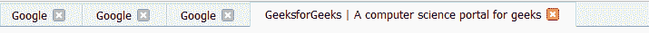
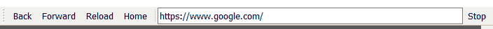

# 使用 PyQt5

创建选项卡式浏览器

> 原文:[https://www . geeksforgeeks . org/creating-a-tab-browser-use-pyqt 5/](https://www.geeksforgeeks.org/creating-a-tabbed-browser-using-pyqt5/)

在本文中，我们将看到如何使用 PyQt5 创建选项卡式浏览器。

**网络浏览器**是用于访问万维网上的信息的软件应用程序。当用户从特定网站请求网页时，网络浏览器从网络服务器检索必要的内容，然后在屏幕上显示该网页。
**Tabbing :** 添加选项卡使浏览器的内部有点复杂，因为现在需要跟踪当前活动的浏览器视图，既要将 UI 元素(URL 栏)更新为当前活动窗口中不断变化的状态，又要确保将 UI 事件分派到正确的 web 视图。
**PyQt5** 是跨平台的 GUI 工具包，一套针对 Qt v5 的 python 绑定。由于该库提供的工具和简单性，人们可以非常容易地开发交互式桌面应用程序。它是使用下面给出的命令安装的

```
pip install PyQt5
```

> **GUI 实现步骤:**
> 1。创建主窗口
> 2。为选项卡创建一个 QTabWidget，将其设置为中心小部件，使它们有文档记录并可关闭，下面是选项卡的外观
> 
> 
> 
> 3.创建一个状态栏来显示状态提示
> 4。创建一个工具栏，并添加导航按钮和线编辑来显示网址，下面是热工具栏的样子
> 
> 
> 
> **后端实现步骤:**
> 1。按下双击
> 2 时，向 QTabWidget 对象添加动作。在双击动作中检查双击是否在无标签上，然后调用打开标签方法
> 3。在打开的选项卡中，方法创建一个 QUrl 对象和 QWebEngineView 对象，并将 QUrl 设置为它，并获得选项卡的索引
> 4。当 url 更改时，向 QWebEngineView 对象添加更新 url 操作。
> 5。在更新中，url 动作检查打开的标签是否调用动作，然后改变 url 栏的 url 并改变光标位置
> 6。加载完成后向 QWebEngineView 对象添加另一个更新标题动作
> 7。在更新标题方法中，如果操作仅由打开选项卡调用
> 8，则将窗口标题更新为页面标题。当标签改变时，给标签增加动作
> 9。在标签内更改动作获取网址更新网址内联编辑和标题
> 10。使用 QWebEngineView 对象的内置功能为导航按钮添加动作，用于重载、后退、停止和前进按钮
> 11。将动作添加到主页按钮，并在动作内将 url 更改为 google.com
> 12。按下回车键
> 13 时，在行编辑中增加动作。在行内，编辑操作获取文本，并将该文本转换为 QUrl 对象，如果为空，则设置方案，并将该 Url 设置为当前选项卡

下面是实现

## 蟒蛇 3

```
# importing required libraries
from PyQt5.QtCore import *
from PyQt5.QtWidgets import *
from PyQt5.QtGui import *
from PyQt5.QtWebEngineWidgets import *
from PyQt5.QtPrintSupport import *
import os
import sys

# main window
class MainWindow(QMainWindow):

    # constructor
    def __init__(self, *args, **kwargs):
        super(MainWindow, self).__init__(*args, **kwargs)

        # creating a tab widget
        self.tabs = QTabWidget()

        # making document mode true
        self.tabs.setDocumentMode(True)

        # adding action when double clicked
        self.tabs.tabBarDoubleClicked.connect(self.tab_open_doubleclick)

        # adding action when tab is changed
        self.tabs.currentChanged.connect(self.current_tab_changed)

        # making tabs closeable
        self.tabs.setTabsClosable(True)

        # adding action when tab close is requested
        self.tabs.tabCloseRequested.connect(self.close_current_tab)

        # making tabs as central widget
        self.setCentralWidget(self.tabs)

        # creating a status bar
        self.status = QStatusBar()

        # setting status bar to the main window
        self.setStatusBar(self.status)

        # creating a tool bar for navigation
        navtb = QToolBar("Navigation")

        # adding tool bar tot he main window
        self.addToolBar(navtb)

        # creating back action
        back_btn = QAction("Back", self)

        # setting status tip
        back_btn.setStatusTip("Back to previous page")

        # adding action to back button
        # making current tab to go back
        back_btn.triggered.connect(lambda: self.tabs.currentWidget().back())

        # adding this to the navigation tool bar
        navtb.addAction(back_btn)

        # similarly adding next button
        next_btn = QAction("Forward", self)
        next_btn.setStatusTip("Forward to next page")
        next_btn.triggered.connect(lambda: self.tabs.currentWidget().forward())
        navtb.addAction(next_btn)

        # similarly adding reload button
        reload_btn = QAction("Reload", self)
        reload_btn.setStatusTip("Reload page")
        reload_btn.triggered.connect(lambda: self.tabs.currentWidget().reload())
        navtb.addAction(reload_btn)

        # creating home action
        home_btn = QAction("Home", self)
        home_btn.setStatusTip("Go home")

        # adding action to home button
        home_btn.triggered.connect(self.navigate_home)
        navtb.addAction(home_btn)

        # adding a separator
        navtb.addSeparator()

        # creating a line edit widget for URL
        self.urlbar = QLineEdit()

        # adding action to line edit when return key is pressed
        self.urlbar.returnPressed.connect(self.navigate_to_url)

        # adding line edit to tool bar
        navtb.addWidget(self.urlbar)

        # similarly adding stop action
        stop_btn = QAction("Stop", self)
        stop_btn.setStatusTip("Stop loading current page")
        stop_btn.triggered.connect(lambda: self.tabs.currentWidget().stop())
        navtb.addAction(stop_btn)

        # creating first tab
        self.add_new_tab(QUrl('http://www.google.com'), 'Homepage')

        # showing all the components
        self.show()

        # setting window title
        self.setWindowTitle("Geek PyQt5")

    # method for adding new tab
    def add_new_tab(self, qurl = None, label ="Blank"):

        # if url is blank
        if qurl is None:
            # creating a google url
            qurl = QUrl('http://www.google.com')

        # creating a QWebEngineView object
        browser = QWebEngineView()

        # setting url to browser
        browser.setUrl(qurl)

        # setting tab index
        i = self.tabs.addTab(browser, label)
        self.tabs.setCurrentIndex(i)

        # adding action to the browser when url is changed
        # update the url
        browser.urlChanged.connect(lambda qurl, browser = browser:
                                   self.update_urlbar(qurl, browser))

        # adding action to the browser when loading is finished
        # set the tab title
        browser.loadFinished.connect(lambda _, i = i, browser = browser:
                                     self.tabs.setTabText(i, browser.page().title()))

    # when double clicked is pressed on tabs
    def tab_open_doubleclick(self, i):

        # checking index i.e
        # No tab under the click
        if i == -1:
            # creating a new tab
            self.add_new_tab()

    # when tab is changed
    def current_tab_changed(self, i):

        # get the curl
        qurl = self.tabs.currentWidget().url()

        # update the url
        self.update_urlbar(qurl, self.tabs.currentWidget())

        # update the title
        self.update_title(self.tabs.currentWidget())

    # when tab is closed
    def close_current_tab(self, i):

        # if there is only one tab
        if self.tabs.count() < 2:
            # do nothing
            return

        # else remove the tab
        self.tabs.removeTab(i)

    # method for updating the title
    def update_title(self, browser):

        # if signal is not from the current tab
        if browser != self.tabs.currentWidget():
            # do nothing
            return

        # get the page title
        title = self.tabs.currentWidget().page().title()

        # set the window title
        self.setWindowTitle("% s - Geek PyQt5" % title)

    # action to go to home
    def navigate_home(self):

        # go to google
        self.tabs.currentWidget().setUrl(QUrl("http://www.google.com"))

    # method for navigate to url
    def navigate_to_url(self):

        # get the line edit text
        # convert it to QUrl object
        q = QUrl(self.urlbar.text())

        # if scheme is blank
        if q.scheme() == "":
            # set scheme
            q.setScheme("http")

        # set the url
        self.tabs.currentWidget().setUrl(q)

    # method to update the url
    def update_urlbar(self, q, browser = None):

        # If this signal is not from the current tab, ignore
        if browser != self.tabs.currentWidget():

            return

        # set text to the url bar
        self.urlbar.setText(q.toString())

        # set cursor position
        self.urlbar.setCursorPosition(0)

# creating a PyQt5 application
app = QApplication(sys.argv)

# setting name to the application
app.setApplicationName("Geek PyQt5")

# creating MainWindow object
window = MainWindow()

# loop
app.exec_()
```

**输出:**

<video class="wp-video-shortcode" id="video-426189-1" width="640" height="360" preload="metadata" controls=""><source type="video/mp4" src="https://media.geeksforgeeks.org/wp-content/uploads/20200607195910/Geek-PyQt5-2020-06-07-19-58-20.mp4?_=1">[https://media.geeksforgeeks.org/wp-content/uploads/20200607195910/Geek-PyQt5-2020-06-07-19-58-20.mp4](https://media.geeksforgeeks.org/wp-content/uploads/20200607195910/Geek-PyQt5-2020-06-07-19-58-20.mp4)</video>