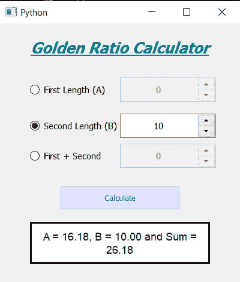

# 使用 PyQt5 创建黄金比例计算器

> 原文:[https://www . geeksforgeeks . org/creating-golden-ratio-calculator-using-pyqt 5/](https://www.geeksforgeeks.org/creating-golden-ratio-calculator-using-pyqt5/)

在本文中，我们将看到如何使用 PyQt5 创建黄金比例计算器。在数学中，如果两个量的比值等于它们之和与两个量中较大者的比值，那么这两个量就是黄金比例。黄金比例的值是 1.61803398875。下面是黄金比例计算器的样子



**PyQt5** 是跨平台的 GUI 工具包，一套针对 Qt v5 的 python 绑定。由于该库提供的工具和简单性，人们可以非常容易地开发交互式桌面应用程序。下面是安装 PyQt5 的命令

```
pip install PyQt5
```

**概念:**
下面是黄金分割比例的计算公式

```
A / B = (A + B) / A = golden_ratio

```

这里 A 是更大的长度，B 是更短的，即长度的第二部分，黄金分割比例的值是 1.618033398875

> **GUI 实现步骤:**
> 1。创建显示计算器名称
> 2 的标题标签。为第一、第二和长度总和
> 3 创建三个单选按钮。创建三个旋转框供用户输入具体长度
> 4。根据黄金比例
> 5 创建用于计算其他值的按钮。创建一个标签来显示计算值
> 
> **后端实现:**
> 1。最初使所有旋转框禁用
> 2。给所有三个单选按钮添加相同的动作
> 3。单选按钮方法中，选中哪个单选按钮
> 4。根据选中的单选按钮，启用相应的旋转框，禁用旋转框的其余部分
> 5。根据选择的单选按钮
> 6 分配标志值。将相同的动作添加到所有三个旋转框中
> 7。在旋转框操作中，检查哪个旋转框被启用，并使其他旋转框值为零
> 8。向按钮
> 9 添加动作。在按钮动作内部检查标志根据标志借助黄金比例公式计算另外两个长度
> 10。格式化计算值，并在结果标签的帮助下显示值

下面是实现

```
# importing libraries
from PyQt5.QtWidgets import * 
from PyQt5 import QtCore, QtGui
from PyQt5.QtGui import * 
from PyQt5.QtCore import * 
import datetime
import sys

class Window(QMainWindow):

    def __init__(self):
        super().__init__()

        # setting title
        self.setWindowTitle("Python ")

        # width of window
        self.w_width = 400

        # height of window
        self.w_height = 430

        # setting geometry
        self.setGeometry(100, 100, self.w_width, self.w_height)

        # calling method
        self.UiComponents()

        # showing all the widgets
        self.show()

    # method for components
    def UiComponents(self):

        # creating head label
        head = QLabel("Golden Ratio Calculator", self)

        head.setWordWrap(True)

        # setting geometry to the head
        head.setGeometry(0, 10, 400, 60)

        # font
        font = QFont('Times', 15)
        font.setBold(True)
        font.setItalic(True)
        font.setUnderline(True)

        # setting font to the head
        head.setFont(font)

        # setting alignment of the head
        head.setAlignment(Qt.AlignCenter)

        # setting color effect to the head
        color = QGraphicsColorizeEffect(self)
        color.setColor(Qt.darkCyan)
        head.setGraphicsEffect(color)

        # creating a radio button
        self.length1 = QRadioButton("First Length (A)", self)

        # setting geometry
        self.length1.setGeometry(50, 90, 140, 40)

        # setting font
        self.length1.setFont(QFont('Times', 9))

        # creating a spin box
        self.l1 = QSpinBox(self)
        self.l1.setMaximum(999999)

        # setting geometry to the spin box
        self.l1.setGeometry(200, 90, 160, 40)

        # setting font
        self.l1.setFont(QFont('Times', 9))

        # setting alignment
        self.l1.setAlignment(Qt.AlignCenter)

        # creating a radio button
        self.length2 = QRadioButton("Second Length (B)", self)

        # setting geometry
        self.length2.setGeometry(50, 150, 145, 40)

        # setting font
        self.length2.setFont(QFont('Times', 9))

        # creating a spin box
        self.l2 = QSpinBox(self)
        self.l2.setMaximum(999999)

        # setting geometry to the spin box
        self.l2.setGeometry(200, 150, 160, 40)

        # setting font
        self.l2.setFont(QFont('Times', 9))

        # setting alignment
        self.l2.setAlignment(Qt.AlignCenter)

        # creating a radio button
        self.length_sum = QRadioButton("First + Second ", self)

        # setting geometry
        self.length_sum.setGeometry(50, 200, 140, 40)

        # setting font
        self.length_sum.setFont(QFont('Times', 9))

        # creating a spin box
        self.l_s = QSpinBox(self)
        self.l_s.setMaximum(999999)

        # setting geometry to the spin box
        self.l_s.setGeometry(200, 200, 160, 40)

        # setting font
        self.l_s.setFont(QFont('Times', 9))

        # setting alignment
        self.l_s.setAlignment(Qt.AlignCenter)

        # adding same action to all the radio button
        self.length1.clicked.connect(self.radio_method)
        self.length2.clicked.connect(self.radio_method)
        self.length_sum.clicked.connect(self.radio_method)

        # adding same action to all the spin box
        self.l1.valueChanged.connect(self.spin_method)
        self.l2.valueChanged.connect(self.spin_method)
        self.l_s.valueChanged.connect(self.spin_method)

        # making all the spin box disabled
        self.l1.setDisabled(True)
        self.l2.setDisabled(True)
        self.l_s.setDisabled(True)

        # creating a push button
        calculate = QPushButton("Calculate", self)

        # setting geometry to the push button
        calculate.setGeometry(100, 270, 200, 40)

        # adding action to the button
        calculate.clicked.connect(self.calculate)

        # adding color effect to the push button
        color = QGraphicsColorizeEffect()
        color.setColor(Qt.blue)
        calculate.setGraphicsEffect(color)

        # creating a label to show result
        self.result = QLabel(self)

        # setting properties to result label
        self.result.setAlignment(Qt.AlignCenter)

        # setting geometry
        self.result.setGeometry(50, 330, 300, 70)

        # making it multi line
        self.result.setWordWrap(True)

        # setting stylesheet
        # adding border and background
        self.result.setStyleSheet("QLabel"
                                  "{"
                                  "border : 3px solid black;"
                                  "background : white;"
                                  "}")

        # setting font
        self.result.setFont(QFont('Arial', 11))

    # method called by the radio buttons
    def radio_method(self):

        # checking who is checked and who is unchecked
        # if first radio button is checked
        if self.length1.isChecked():

            # making first spin box enable
            self.l1.setEnabled(True)

            # making rest two spin box disable
            self.l2.setDisabled(True)
            self.l_s.setDisabled(True)

            # assigning flags
            self.check1 = True
            self.check2 = False
            self.check_sum = False

        elif self.length2.isChecked():

            # making second spin box enable
            self.l2.setEnabled(True)

            # making rest two spin box disable
            self.l1.setDisabled(True)
            self.l_s.setDisabled(True)

            # assigning flags
            self.check1 = False
            self.check2 = True
            self.check_sum = False

        elif self.length_sum.isChecked():

            # making third spin box enable
            self.l_s.setEnabled(True)

            # making rest two spin box disable
            self.l1.setDisabled(True)
            self.l2.setDisabled(True)

            # assigning flags
            self.check1 = False
            self.check2 = False
            self.check_sum = True

    def spin_method(self):

        # finding who called the method
        if self.l1.isEnabled():

            # setting current values
            self.l2.setValue(0)
            self.l_s.setValue(0)

        elif self.l2.isEnabled():

            # setting current values
            self.l1.setValue(0)
            self.l_s.setValue(0)

        else:
            # setting current values
            self.l2.setValue(0)
            self.l1.setValue(0)

    def calculate(self):

        golden = 1.61803398875

        # if first value is selected
        if self.check1 == True:

            # getting spin box value
            A = self.l1.value()

            B = A / golden

            Sum = A + B

        elif self.check2 == True:

            # getting spin box value
            B = self.l2.value()

            A = B * golden

            Sum = A + B

        else:
            # getting spin box value
            Sum = self.l_s.value()

            A = Sum / golden

            B = Sum - A

        # formatting values upto two decimal
        A = "{:.2f}".format(A)
        B = "{:.2f}".format(B)
        Sum = "{:.2f}".format(Sum)

        # setting text to the label
        self.result.setText("A = " + str(A) + ", B = " + str(B) + 
                                        " and Sum = " + str(Sum))

# create pyqt5 app
App = QApplication(sys.argv)

# create the instance of our Window
window = Window()

# start the app
sys.exit(App.exec())
```

**输出:**

<video class="wp-video-shortcode" id="video-442098-1" width="640" height="688" preload="metadata" controls=""><source type="video/mp4" src="https://media.geeksforgeeks.org/wp-content/uploads/20200629035629/Python-2020-06-29-03-55-32.mp4?_=1">[https://media.geeksforgeeks.org/wp-content/uploads/20200629035629/Python-2020-06-29-03-55-32.mp4](https://media.geeksforgeeks.org/wp-content/uploads/20200629035629/Python-2020-06-29-03-55-32.mp4)</video>