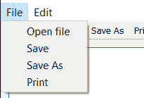
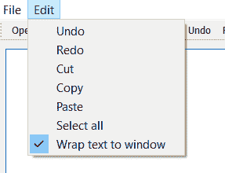
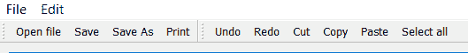

# 使用 PyQt5–Python 创建记事本

> 原文:[https://www . geesforgeks . org/creating-notepad-use-pyqt 5-python/](https://www.geeksforgeeks.org/creating-notepad-using-pyqt5-python/)

在本文中，我们将看到如何使用 PyQt5 创建记事本。
**记事本**是一个通用的文本编辑器，允许你创建、打开、编辑和读取明文文件。
**PyQt5** 是跨平台的 GUI 工具包，一套针对 Qt v5 的 python 绑定。由于该库提供的工具和简单性，人们可以非常容易地开发交互式桌面应用程序。
**使用此命令安装 PyQt5 :**

```
pip install PyQt5
```

> **GUI 实现步骤:**
> 1。创建垂直布局
> 2。创建一个 QPlainTextEdit 对象，并将其添加到布局中
> 3。创建一个容器，即 QWidget 对象
> 4。将该垂直布局设置到容器
> 5。创建状态栏以显示状态提示
> 6。创建文件菜单栏并添加文件操作下面是文件菜单栏的外观
> 
> 
> 
> 7.创建一个编辑菜单栏并添加各种编辑动作，下面是编辑菜单栏的样子
> 
> 
> 
> 8.为文件和编辑动作创建两个工具栏，下面是工具栏的外观
> 
> 
> 
> **后端实现步骤:**
> 1。创建一个路径变量并将其设置为无
> 2。将动作添加到每个文件菜单动作这些都是相同的工具栏动作，因为两者共享相同的动作
> 3。创建一个关键方法，在弹出窗口中显示传递的值，用于显示保存或打开文件时是否出现错误
> 4。创建根据文件名称改变窗口标题的更新标题方法
> 5。在文件打开动作中，创建一个尝试打开文件的尝试除外块，然后更新标题和路径
> 6。在保存操作中，如果路径为无，调用另存为方法，否则将文件保存到路径
> 7。在另存为方法中，将文件保存在用户选择的路径上
> 8。在打印操作中，使用 QPrintDialog 对象
> 9 打印文件。在编辑切换栏动作中，根据选中状态
> 10 设置编辑器的换行模式。使用内置功能
> 的 QPlainTextEdit 对象，类似地设置撤销、重做、剪切、复制、粘贴和全选动作

下面是实现

## 蟒蛇 3

```
# importing required libraries
from PyQt5.QtGui import *
from PyQt5.QtWidgets import *
from PyQt5.QtCore import *
from PyQt5.QtPrintSupport import *
import os
import sys

# Creating main window class
class MainWindow(QMainWindow):

    # constructor
    def __init__(self, *args, **kwargs):
        super(MainWindow, self).__init__(*args, **kwargs)

        # setting window geometry
        self.setGeometry(100, 100, 600, 400)

        # creating a layout
        layout = QVBoxLayout()

        # creating a QPlainTextEdit object
        self.editor = QPlainTextEdit()

        # setting font to the editor
        fixedfont = QFontDatabase.systemFont(QFontDatabase.FixedFont)
        fixedfont.setPointSize(12)
        self.editor.setFont(fixedfont)

        # self.path holds the path of the currently open file.
        # If none, we haven't got a file open yet (or creating new).
        self.path = None

        # adding editor to the layout
        layout.addWidget(self.editor)

        # creating a QWidget layout
        container = QWidget()

        # setting layout to the container
        container.setLayout(layout)

        # making container as central widget
        self.setCentralWidget(container)

        # creating a status bar object
        self.status = QStatusBar()

        # setting stats bar to the window
        self.setStatusBar(self.status)

        # creating a file tool bar
        file_toolbar = QToolBar("File")

        # adding file tool bar to the window
        self.addToolBar(file_toolbar)

        # creating a file menu
        file_menu = self.menuBar().addMenu("&File")

        # creating actions to add in the file menu
        # creating a open file action
        open_file_action = QAction("Open file", self)

        # setting status tip
        open_file_action.setStatusTip("Open file")

        # adding action to the open file
        open_file_action.triggered.connect(self.file_open)

        # adding this to file menu
        file_menu.addAction(open_file_action)

        # adding this to tool bar
        file_toolbar.addAction(open_file_action)

        # similarly creating a save action
        save_file_action = QAction("Save", self)
        save_file_action.setStatusTip("Save current page")
        save_file_action.triggered.connect(self.file_save)
        file_menu.addAction(save_file_action)
        file_toolbar.addAction(save_file_action)

        # similarly creating save action
        saveas_file_action = QAction("Save As", self)
        saveas_file_action.setStatusTip("Save current page to specified file")
        saveas_file_action.triggered.connect(self.file_saveas)
        file_menu.addAction(saveas_file_action)
        file_toolbar.addAction(saveas_file_action)

        # for print action
        print_action = QAction("Print", self)
        print_action.setStatusTip("Print current page")
        print_action.triggered.connect(self.file_print)
        file_menu.addAction(print_action)
        file_toolbar.addAction(print_action)

        # creating another tool bar for editing text
        edit_toolbar = QToolBar("Edit")

        # adding this tool bar to the main window
        self.addToolBar(edit_toolbar)

        # creating a edit menu bar
        edit_menu = self.menuBar().addMenu("&Edit")

        # adding actions to the tool bar and menu bar

        # undo action
        undo_action = QAction("Undo", self)
        # adding status tip
        undo_action.setStatusTip("Undo last change")

        # when triggered undo the editor
        undo_action.triggered.connect(self.editor.undo)

        # adding this to tool and menu bar
        edit_toolbar.addAction(undo_action)
        edit_menu.addAction(undo_action)

        # redo action
        redo_action = QAction("Redo", self)
        redo_action.setStatusTip("Redo last change")

        # when triggered redo the editor
        redo_action.triggered.connect(self.editor.redo)

        # adding this to menu and tool bar
        edit_toolbar.addAction(redo_action)
        edit_menu.addAction(redo_action)

        # cut action
        cut_action = QAction("Cut", self)
        cut_action.setStatusTip("Cut selected text")

        # when triggered cut the editor text
        cut_action.triggered.connect(self.editor.cut)

        # adding this to menu and tool bar
        edit_toolbar.addAction(cut_action)
        edit_menu.addAction(cut_action)

        # copy action
        copy_action = QAction("Copy", self)
        copy_action.setStatusTip("Copy selected text")

        # when triggered copy the editor text
        copy_action.triggered.connect(self.editor.copy)

        # adding this to menu and tool bar
        edit_toolbar.addAction(copy_action)
        edit_menu.addAction(copy_action)

        # paste action
        paste_action = QAction("Paste", self)
        paste_action.setStatusTip("Paste from clipboard")

        # when triggered paste the copied text
        paste_action.triggered.connect(self.editor.paste)

        # adding this to menu and tool bar
        edit_toolbar.addAction(paste_action)
        edit_menu.addAction(paste_action)

        # select all action
        select_action = QAction("Select all", self)
        select_action.setStatusTip("Select all text")

        # when this triggered select the whole text
        select_action.triggered.connect(self.editor.selectAll)

        # adding this to menu and tool bar
        edit_toolbar.addAction(select_action)
        edit_menu.addAction(select_action)

        # wrap action
        wrap_action = QAction("Wrap text to window", self)
        wrap_action.setStatusTip("Check to wrap text to window")

        # making it checkable
        wrap_action.setCheckable(True)

        # making it checked
        wrap_action.setChecked(True)

        # adding action
        wrap_action.triggered.connect(self.edit_toggle_wrap)

        # adding it to edit menu not to the tool bar
        edit_menu.addAction(wrap_action)

        # calling update title method
        self.update_title()

        # showing all the components
        self.show()

    # creating dialog critical method
    # to show errors
    def dialog_critical(self, s):

        # creating a QMessageBox object
        dlg = QMessageBox(self)

        # setting text to the dlg
        dlg.setText(s)

        # setting icon to it
        dlg.setIcon(QMessageBox.Critical)

        # showing it
        dlg.show()

    # action called by file open action
    def file_open(self):

        # getting path and bool value
        path, _ = QFileDialog.getOpenFileName(self, "Open file", "",
                             "Text documents (*.txt);All files (*.*)")

        # if path is true
        if path:
            # try opening path
            try:
                with open(path, 'rU') as f:
                    # read the file
                    text = f.read()

            # if some error occured
            except Exception as e:

                # show error using critical method
                self.dialog_critical(str(e))
            # else
            else:
                # update path value
                self.path = path

                # update the text
                self.editor.setPlainText(text)

                # update the title
                self.update_title()

    # action called by file save action
    def file_save(self):

        # if there is no save path
        if self.path is None:

            # call save as method
            return self.file_saveas()

        # else call save to path method
        self._save_to_path(self.path)

    # action called by save as action
    def file_saveas(self):

        # opening path
        path, _ = QFileDialog.getSaveFileName(self, "Save file", "",
                             "Text documents (*.txt);All files (*.*)")

        # if dialog is cancelled i.e no path is selected
        if not path:
            # return this method
            # i.e no action performed
            return

        # else call save to path method
        self._save_to_path(path)

    # save to path method
    def _save_to_path(self, path):

        # get the text
        text = self.editor.toPlainText()

        # try catch block
        try:

            # opening file to write
            with open(path, 'w') as f:

                # write text in the file
                f.write(text)

        # if error occurs
        except Exception as e:

            # show error using critical
            self.dialog_critical(str(e))

        # else do this
        else:
            # change path
            self.path = path
            # update the title
            self.update_title()

    # action called by print
    def file_print(self):

        # creating a QPrintDialog
        dlg = QPrintDialog()

        # if executed
        if dlg.exec_():

            # print the text
            self.editor.print_(dlg.printer())

    # update title method
    def update_title(self):

        # setting window title with prefix as file name
        # suffix aas PyQt5 Notepad
        self.setWindowTitle("%s - PyQt5 Notepad" %(os.path.basename(self.path)
                                                  if self.path else "Untitled"))

    # action called by edit toggle
    def edit_toggle_wrap(self):

        # chaining line wrap mode
        self.editor.setLineWrapMode(1 if self.editor.lineWrapMode() == 0 else 0 )

# drivers code
if __name__ == '__main__':

    # creating PyQt5 application
    app = QApplication(sys.argv)

    # setting application name
    app.setApplicationName("PyQt5-Note")

    # creating a main window object
    window = MainWindow()

    # loop
    app.exec_()
```

**输出:**

<video class="wp-video-shortcode" id="video-427480-1" width="640" height="360" preload="metadata" controls=""><source type="video/mp4" src="https://media.geeksforgeeks.org/wp-content/uploads/20200606133621/Untitled-PyQt5-Notepad-2020-06-06-13-35-32.mp4?_=1">[https://media.geeksforgeeks.org/wp-content/uploads/20200606133621/Untitled-PyQt5-Notepad-2020-06-06-13-35-32.mp4](https://media.geeksforgeeks.org/wp-content/uploads/20200606133621/Untitled-PyQt5-Notepad-2020-06-06-13-35-32.mp4)</video>