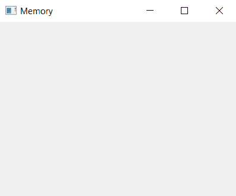

# 在 PyQt5 中删除 late()方法

> 原文:[https://www.geeksforgeeks.org/deletelater-method-in-pyqt5/](https://www.geeksforgeeks.org/deletelater-method-in-pyqt5/)

在设计应用程序时，如果关闭小部件时不小心，它可能会消耗大量空间/内存。基于 QObject 的类被设计成(可选地)在层次结构中链接在一起。当顶级对象被删除时，Qt 也会自动删除它的所有子对象。但是，关闭小部件时，只有设置了`Qt.WA_DeleteOnClose` 属性才会自动删除(默认情况下，通常不会)。

在 PyQt5 中，对象所有权有两个方面: **Python 部分**和 **Qt 部分**。通常，删除对对象的最后一个 Python 引用不足以完全清除，因为 Qt 端仍然可能有一个引用。一般来说，Qt 倾向于不隐式删除对象。因此，如果您的应用程序创建并删除了许多小部件，如果内存使用是一个问题，您可能需要采取措施明确删除它们。

`deleteLater()`方法允许我们显式删除小部件的引用。

> **语法:**widget . delete late()
> 
> **论证:**不需要论证。
> 
> **执行的操作:**从内存中删除/移除小部件的引用。

**代码:**

```py
# importing the required libraries

from PyQt5.QtWidgets import * 
from PyQt5 import QtCore
from PyQt5 import QtGui
import sys

class Window(QMainWindow):
    def __init__(self):
        super().__init__()

        # set the title
        self.setWindowTitle("Memory")

        # setting  the geometry of window
        self.setGeometry(0, 0, 400, 300)

        # creating a label widget
        self.label_1 = QLabel("Label", self)

        # moving position
        self.label_1.move(100, 100)

        # setting up border
        self.label_1.setStyleSheet("border: 1px solid black;")

        # delete reference
        self.label_1.deleteLater()

        # show all the widgets
        self.show()

# create pyqt5 app
App = QApplication(sys.argv)

# create the instance of our Window
window = Window()

# start the app
sys.exit(App.exec())
```

它将从内存中删除与标签小部件相关联的引用。
**输出:**
