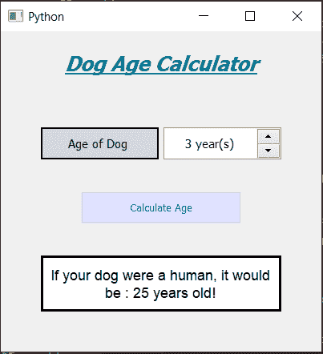

# 使用 PyQt5 的狗年计算器

> 原文:[https://www . geesforgeks . org/dog-years-calculator-using-pyqt 5/](https://www.geeksforgeeks.org/dog-years-calculator-using-pyqt5/)

在本文中，我们将看到如何使用 [**PyQt5**](https://www.geeksforgeeks.org/python-introduction-to-pyqt5/) 创建狗年计算器。狗年计算器将告诉狗的年龄如果狗是人类，狗长得比人类快得多。下面是计算器的样子:



**PyQt5** 是一个跨平台的 GUI 工具包，一套针对 Qt v5 的 python 绑定。由于该库提供的工具和简单性，人们可以非常容易地开发交互式桌面应用程序。下面是安装 PyQt5 的命令

```py
pip install PyQt5

```

**GUI 实现步骤:**

1.  创建显示计算器名称的标题标签。
2.  创建一个标签，显示用户输入狗的年龄。
3.  创建一个 QSpinBox 对象供用户输入年份。
4.  创建用于计算年龄的按钮。
5.  创建一个标签来显示计算出的年龄。

**后端实现:**

1.  向按钮添加操作。
2.  设置旋转框的最小值和最大值。
3.  在按钮内部，一个动作获得旋转框的值。
4.  如果该值为 1，则年龄为 15 岁，如果该值为 2，则年龄为 24 岁，否则年龄将在接下来的几年中增加 4 岁。
5.  借助标签显示计算出的年龄。

下面是实现

## 蟒蛇 3

```py
# importing required libraries
from PyQt5.QtWidgets import * 
from PyQt5 import QtCore, QtGui
from PyQt5.QtGui import * 
from PyQt5.QtCore import * 
import datetime
import sys

# window class
class Window(QMainWindow):

    # Constructor 
    def __init__(self):
        super().__init__()

        # setting title of the window
        self.setWindowTitle("Python ")

        # width of the window
        self.w_width = 400

        # height of the window
        self.w_height = 400

        # setting geometry of the window
        self.setGeometry(100, 100, self.w_width, self.w_height)

        # method calling
        self.UiComponents()

        # showing all the widgets
        self.show()

    # method for components creation
    def UiComponents(self):
        # creating head label
        head = QLabel("Dog Age Calculator", self)

        head.setWordWrap(True)

        # setting geometry of the head
        head.setGeometry(0, 10, 400, 60)

        # font work 
        font = QFont('Times', 15)
        font.setBold(True)
        font.setItalic(True)
        font.setUnderline(True)

        # setting font to the head
        head.setFont(font)

        # setting alignment of the head
        head.setAlignment(Qt.AlignCenter)

        # setting color effect to the head
        color = QGraphicsColorizeEffect(self)
        color.setColor(Qt.darkCyan)
        head.setGraphicsEffect(color)

        # creating a label
        age_label = QLabel("Age of Dog ", self)

        # setting geometry to the label
        age_label.setGeometry(50, 120, 147, 40)

        # setting alignment
        age_label.setAlignment(Qt.AlignCenter)

        # setting stylesheet
        age_label.setStyleSheet("QLabel"
                                 "{"
                                 "border : 2px solid black;"
                                 "background : rgba(70, 70, 70, 35);"
                                 "}")

        age_label.setFont(QFont('Times', 9))

        # creating a spin box
        self.age = QSpinBox(self)

        # setting geometry to the spin box
        self.age.setGeometry(203, 120, 147, 40)

        # setting maximum value of spin box
        self.age.setMaximum(20)

        # setting minimum value of spin box
        self.age.setMinimum(1)

        # setting suffix to the spin box
        self.age.setSuffix(" year(s)")

        # setting font and alignment
        self.age.setFont(QFont('Times', 9))
        self.age.setAlignment(Qt.AlignCenter)

        # creating a push button
        calculate = QPushButton("Calculate Age", self)

        # setting geometry to the push button
        calculate.setGeometry(100, 200, 200, 40)

        # adding action to the button
        calculate.clicked.connect(self.calculate)

        # adding color effect to the push button
        color = QGraphicsColorizeEffect()
        color.setColor(Qt.blue)
        calculate.setGraphicsEffect(color)

        # creating a label to show result
        self.result = QLabel(self)

        # setting properties to result label
        self.result.setAlignment(Qt.AlignCenter)

        # setting geometry
        self.result.setGeometry(50, 280, 300, 70)

        # making it multi line
        self.result.setWordWrap(True)

        # setting stylesheet
        # adding border and background
        self.result.setStyleSheet("QLabel"
                                  "{"
                                  "border : 3px solid black;"
                                  "background : white;"
                                  "}")

        # setting font
        self.result.setFont(QFont('Arial', 11))

    # method for calculating the dog's age
    def calculate(self):

        # getting the spin box value
        value = self.age.value()

        # if value is 1
        if value == 1:

            # dog age is 15
            d_age = 15

        # if value is 2
        elif value == 2:

            # dog age is 24
            d_age = 24

        # else dog age get incremented by 4
        else:
            d_age = 24 + (value - 2) * 4

        # showing age through label
        self.result.setText("If your dog were a human, it would be : " +str(d_age) + " years old !")

# create pyqt5 app
App = QApplication(sys.argv)

# create the instance of our Window
window = Window()

# start the app
sys.exit(App.exec())
```

**输出:**

<video class="wp-video-shortcode" id="video-439679-1" width="640" height="360" preload="metadata" controls=""><source type="video/mp4" src="https://media.geeksforgeeks.org/wp-content/uploads/20200625223641/Python-2020-06-25-22-36-08.mp4?_=1">[https://media.geeksforgeeks.org/wp-content/uploads/20200625223641/Python-2020-06-25-22-36-08.mp4](https://media.geeksforgeeks.org/wp-content/uploads/20200625223641/Python-2020-06-25-22-36-08.mp4)</video>