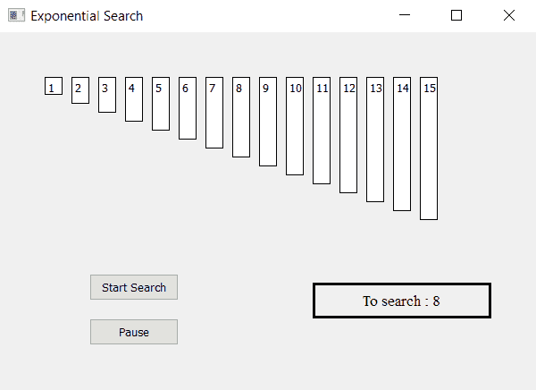

# 使用 PyQt5 的指数搜索可视化工具

> 原文:[https://www . geesforgeks . org/index-search-visualizer-using-pyqt 5/](https://www.geeksforgeeks.org/exponential-search-visualizer-using-pyqt5/)

在本文中，我们将看到如何制作一个 PyQt5 应用程序，它将可视化指数搜索算法。

**指数搜索**也可以用来在有界列表中搜索。当要搜索的元素接近数组的开头时，指数搜索甚至可以超越传统的有界列表搜索，例如二分搜索法。这是因为指数搜索将在 O(log i)时间内运行，其中 I 是列表中正在搜索的元素的索引，而二分搜索法将在 O(log n)时间内运行，其中 n 是列表中的元素数量。



> **GUI 实现步骤:**
> 
> 1.根据给定的数字列表
> 2 创建标签列表。将它们的文字、边框、颜色和几何形状设置为彼此之间有相应的间隙
> 3。每个标签高度应与每个数字的值成比例
> 4。创建开始和暂停按钮，开始搜索并暂停搜索
> 5。创建结果标签以显示搜索状态
> 
> **后端实现步骤:**
> 1。创建对应于给定编号的标签列表
> 2。为指数搜索使用的索引创建变量，并为二分搜索法索引和搜索标志以及二进制和指数搜索标志创建其他变量。
> 3。向按钮添加动作他们的动作应该改变标志状态，即开始动作应该使标志为真，暂停动作应该使标志为假。
> 4。创建定时器对象，该对象在每个特定时间后调用一个方法
> 5。定时器方法内部检查标志是否为真标志开始指数搜索算法
> 6。检查数值是否在范围内，如果没有，显示输出为未找到，否则继续
> 7。开始在索引处查找值如果找到，停止搜索并显示结果，否则将索引值加倍
> 8。找到数值的范围，启动二分搜索法，设置二分搜索法的上下数值
> 9。在二分搜索法的帮助下展示成果

下面是实现

```py
# importing libraries
from PyQt5.QtWidgets import * 
from PyQt5 import QtCore, QtGui
from PyQt5.QtGui import * 
from PyQt5.QtCore import * 
import sys

class Window(QMainWindow):
    # list of numbers
    number = [1, 2, 3, 4, 5, 6, 7, 8, 9,
                 10, 11, 12, 13, 14, 15]

    def __init__(self):
        super().__init__()

        # setting title
        self.setWindowTitle("Exponential Search")

        # setting geometry
        self.setGeometry(100, 100, 600, 400)

        # calling method
        self.UiComponents()

        # showing all the widgets
        self.show()

    # method for widgets
    def UiComponents(self):

        # start flag
        self.start = False
        self.binary = False
        self.expo = True

        # list to hold labels
        self.label_list = []

        # desired value
        self.desired = 8

        # Exponential Search variable
        self.index = 1

        # binary search variable
        self.first = 0
        self.last = len(self.number) - 1
        self.mid = 0

        # local counter
        c = 0

        # iterating list of numbers
        for i in self.number:
            # creating label for each number
            label = QLabel(str(i), self)

            # adding background color and border
            label.setStyleSheet("border : 1px solid black; 
                                 background : white;")

            # aligning the text
            label.setAlignment(Qt.AlignTop)

            # setting geometry using local counter
            # first parameter is distance from left
            # and second is distance from top
            # third is width and forth is height
            label.setGeometry(50 + c * 30, 50, 20, i * 10 + 10)

            # adding label to the label list
            self.label_list.append(label)

            # incrementing local counter
            c = c + 1

        # creating push button to start the search
        self.search_button = QPushButton("Start Search", self)

        # setting geometry of the button
        self.search_button.setGeometry(100, 270, 100, 30)

        # adding action to the search button
        self.search_button.clicked.connect(self.search_action)

        # creating push button to pause the search
        pause_button = QPushButton("Pause", self)

        # setting geometry of the button
        pause_button.setGeometry(100, 320, 100, 30)

        # adding action to the search button
        pause_button.clicked.connect(self.pause_action)

        # creating label to show the result
        self.result = QLabel("To search : " + str(self.desired), self)

        # setting geometry
        self.result.setGeometry(350, 280, 200, 40)

        # setting style sheet
        self.result.setStyleSheet("border : 3px solid black;")

        # adding font
        self.result.setFont(QFont('Times', 10))

        # setting alignment
        self.result.setAlignment(Qt.AlignCenter)

        # creating a timer object
        timer = QTimer(self)

        # adding action to timer
        timer.timeout.connect(self.showTime)

        # update the timer every 300 millisecond
        timer.start(300)

    # method called by timer
    def showTime(self):

        # checking if flag is true
        if self.start:

            # Exponential Search
            if self.expo:

                # if equal for index value 0
                if self.number[0] == self.desired:
                    # stop the searching
                    self.start = False

                    # show the result and make the label green
                    self.result.setText("Found at index : 0" )
                    self.label_list[self.index].setStyleSheet(
                                    "border : 2px solid green;"
                                    "background-color : lightgreen")

                # if not equal
                else:
                    # make the label grey
                    self.label_list[0].setStyleSheet(
                              "border : 1px solid black;"
                              "background-color : grey")

                # double the value of index
                self.index = self.index * 2

                # temporary stores index
                temp = self.index

                # checking if index is greater then the len of list
                if self.index >= len(self.number):

                    # update the index
                    self.index = len(self.number) - 1

                    # start binary search
                    self.expo = False
                    self.binary = True

                    # set variable of binary search
                    self.first = temp//2
                    self.last = self.index

                # if desired value is smaller
                if self.desired < self.number[self.index]:

                    # start binary search
                    self.expo = False
                    self.binary = True

                    # set binary search variables
                    self.first = temp//2
                    self.last = self.index

                # if number is equal to the index value
                if self.number[self.index] == self.desired:

                    # stop the search
                    self.start = False

                    # show result and make label color green
                    self.result.setText("Found at index : " + str(self.index))
                    self.label_list[self.index].setStyleSheet(
                                    "border : 2px solid green;"
                                    "background-color : lightgreen")

                # if not equal
                else:
                    # make label color grey
                    self.label_list[self.index].setStyleSheet(
                                    "border : 1px solid black;"
                                    "background-color : grey")

            # binary search
            if self.binary:
                # implementing binary search
                # finding mid index
                self.mid = (self.first + self.last) // 2

                # if first index become greater than last index
                if self.first > self.last:
                    # make start flag false
                    self.start = False
                    # show output as not found
                    self.result.setText("Not Found")

                # if mid value is equal to the desired value
                if self.number[self.mid] == self.desired:

                    # make flag false
                    self.start = False

                    # show output in result label
                    self.result.setText("Found at index : " + str(self.mid))

                    # set color of label to green
                    self.label_list[self.mid].setStyleSheet(
                                     "border : 2px solid green; "
                                     "background-color : lightgreen")

                # if not equal to mid value
                else:
                    # make color grey
                    self.label_list[self.mid].setStyleSheet(
                                  "border : 1px solid black; "
                                  "background-color : grey")

                # mid value is higher
                if self.number[self.mid] > self.desired:
                    # change last index
                    self.last = self.mid - 1

                # if mid value is smaller
                if self.number[self.mid] < self.desired:
                    # change first index
                    self.first = self.mid + 1

    # method called by search button
    def search_action(self):

        # making flag true
        self.start = True

        # showing text in result label
        self.result.setText("Started searching...")

    # method called by pause button
    def pause_action(self):

        # making flag false
        self.start = False

        # showing text in result label
        self.result.setText("Paused")

# create pyqt5 app
App = QApplication(sys.argv)

# create the instance of our Window
window = Window()

# start the app
sys.exit(App.exec())
```

**输出:**

<video class="wp-video-shortcode" id="video-406356-1" width="640" height="428" preload="metadata" controls=""><source type="video/mp4" src="https://media.geeksforgeeks.org/wp-content/uploads/20200421004245/Exponential-Search-21-04-2020-00_32_18.mp4?_=1">[https://media.geeksforgeeks.org/wp-content/uploads/20200421004245/Exponential-Search-21-04-2020-00_32_18.mp4](https://media.geeksforgeeks.org/wp-content/uploads/20200421004245/Exponential-Search-21-04-2020-00_32_18.mp4)</video>