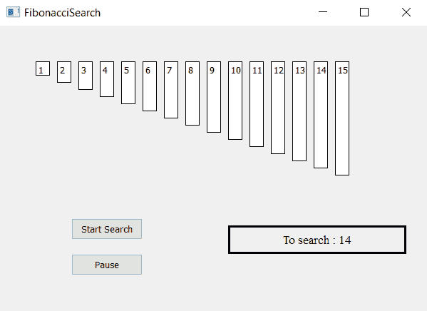

# 使用 PyQt5 的斐波那契搜索可视化工具

> 原文:[https://www . geeksforgeeks . org/Fibonacci-search-visualizer-using-pyqt 5/](https://www.geeksforgeeks.org/fibonacci-search-visualizer-using-pyqt5/)

在本文中，我们将看到如何制作一个 PyQt5 应用程序，它将可视化指数搜索算法。

[**【斐波那契搜索】**](https://www.geeksforgeeks.org/fibonacci-search/) 技术是一种使用分治算法搜索排序数组的方法，该算法借助斐波那契数缩小可能的位置。[1]与二分搜索法将排序后的数组分成两个大小相等的部分(其中一个将进一步研究)相比，斐波那契搜索将数组分成两个大小为连续斐波那契数的部分。



> **GUI 实现步骤:**
> 1。根据给定的数字列表
> 2 创建标签列表。将它们的文字、边框、颜色和几何图形设置为彼此有相应的间隙
> 3。每个标签高度应与每个数字
> 4 的值成比例。创建开始和暂停按钮，开始搜索并暂停搜索
> 5。创建结果标签，显示搜索状态
> **后端实现步骤:**
> 1。创建对应于给定编号的标签列表
> 2。为斐波那契搜索使用的索引和搜索标志以及搜索最小斐波那契数和获得斐波那契数后搜索值的标志创建变量
> 3。向按钮添加动作他们的动作应该改变标志状态，即开始动作应该使标志为真，暂停动作应该使标志为假
> 4。创建定时器对象，该对象在每个特定时间后调用一个方法
> 5。在定时器方法中检查标志是否为真标志为真开始搜索斐波那契数
> 6。找到斐波那契数后，在范围
> 7 内找到给定的数。显示结果

下面是实现

## 蟒蛇 3

```
# importing libraries
from PyQt5.QtWidgets import *
from PyQt5 import QtCore, QtGui
from PyQt5.QtGui import *
from PyQt5.QtCore import *
import sys

class Window(QMainWindow):
    # list of numbers
    number = [1, 2, 3, 4, 5, 6, 7, 8, 9, 10, 11, 12, 13, 14, 15]

    # desired list
    desired = 14

    def __init__(self):
        super().__init__()

        # setting title
        self.setWindowTitle("Fibonacci Search")

        # setting geometry
        self.setGeometry(100, 100, 600, 400)

        # calling method
        self.UiComponents()

        # showing all the widgets
        self.show()

    # method for widgets
    def UiComponents(self):

        # start flag
        self.start = False

        # divide flag
        self.divide = False
        self.fib_search = True

        # list to hold labels
        self.label_list = []

        # fibonacci numbers
        self.fib1 = 1
        self.fib2 = 0
        self.fib = self.fib1 + self.fib2

        self.offset = -1

        # local counter
        c = 0

        # iterating list of numbers
        for i in self.number:
            # creating label for each number
            label = QLabel(str(i), self)

            # adding background color and border
            label.setStyleSheet("border : 1px solid black;
                                 background : white;")

            # aligning the text
            label.setAlignment(Qt.AlignTop)

            # setting geometry using local counter
            # first parameter is distance from left
            # and second is distance from top
            # third is width and forth is height
            label.setGeometry(50 + c * 30, 50, 20, i * 10 + 10)

            # adding label to the label list
            self.label_list.append(label)

            # incrementing local counter
            c = c + 1

        # creating push button to start the search
        self.search_button = QPushButton("Start Search", self)

        # setting geometry of the button
        self.search_button.setGeometry(100, 270, 100, 30)

        # adding action to the search button
        self.search_button.clicked.connect(self.search_action)

        # creating push button to pause the search
        pause_button = QPushButton("Pause", self)

        # setting geometry of the button
        pause_button.setGeometry(100, 320, 100, 30)

        # adding action to the search button
        pause_button.clicked.connect(self.pause_action)

        # creating label to show the result
        self.result = QLabel("To search : " + str(self.desired), self)

        # setting geometry
        self.result.setGeometry(320, 280, 250, 40)

        # setting style sheet
        self.result.setStyleSheet("border : 3px solid black;")

        # adding font
        self.result.setFont(QFont('Times', 10))

        # setting alignment
        self.result.setAlignment(Qt.AlignCenter)

        # creating a timer object
        timer = QTimer(self)

        # adding action to timer
        timer.timeout.connect(self.showTime)

        # update the timer every 300 millisecond
        timer.start(300)

    # method called by timer
    def showTime(self):

        # checking if flag is true
        if self.start:

            # search fibonacci number
            if self.fib_search:

                # searching for the Fibonacci number greater
                # then the desired number
                if self.fib < len(self.number):

                    self.fib2 = self.fib1
                    self.fib1 = self.fib
                    self.fib = self.fib2 + self.fib1
                    self.result.setText("Searching Fibonacci number >=" +
                                                        str(self.desired))

                # start divide search
                else:
                    self.result.setText("Fibonacci found, searching number")
                    self.fib_search = False
                    self.divide = True

            # start divide search
            if self.divide:

                if self.fib <= 1:
                    self.result.setText("Not found")
                    self.start = False
                    return

                i = min(self.offset + self.fib2, len(self.number) - 1)

                self.label_list[i].setStyleSheet("border : 1px solid black;"
                                                 "background-color : grey")

                # If desired is greater than the value at
                # index fib2, cut the subarray array
                # from offset to i
                if (self.number[i] < self.desired):
                    self.fib = self.fib1
                    self.fib1 = self.fib2
                    self.fib2 = self.fib - self.fib1
                    self.offset = i

                # If desired is greater than the value at
                # index fib2, cut the subarray
                # after i + 1
                elif (self.number[i] > self.desired):
                    self.fib = self.fib2
                    self.fib1 = self.fib1 - self.fib2
                    self.fib2 = self.fib - self.fib1

                # element found. show result and stop search
                else:
                    self.result.setText("Found at : " + str(i))
                    self.label_list[i].setStyleSheet(
                                 "border : 2px solid green;"
                                 "background-color : lightgreen;")
                    self.start = False

    # method called by search button
    def search_action(self):

        # making flag true
        self.start = True

        # showing text in result label
        self.result.setText("Started searching...")

    # method called by pause button
    def pause_action(self):

        # making flag false
        self.start = False

        # showing text in result label
        self.result.setText("Paused")

# create pyqt5 app
App = QApplication(sys.argv)

# create the instance of our Window
window = Window()

# start the app
sys.exit(App.exec())
```

**输出:**

<video class="wp-video-shortcode" id="video-402579-1" width="640" height="360" preload="metadata" controls=""><source type="video/mp4" src="https://media.geeksforgeeks.org/wp-content/uploads/20200423014618/Fibonacci-Search-23-04-2020-01_45_54.mp4?_=1">[https://media.geeksforgeeks.org/wp-content/uploads/20200423014618/Fibonacci-Search-23-04-2020-01_45_54.mp4](https://media.geeksforgeeks.org/wp-content/uploads/20200423014618/Fibonacci-Search-23-04-2020-01_45_54.mp4)</video>