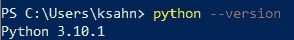
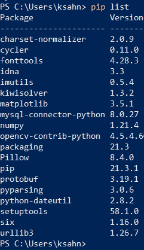
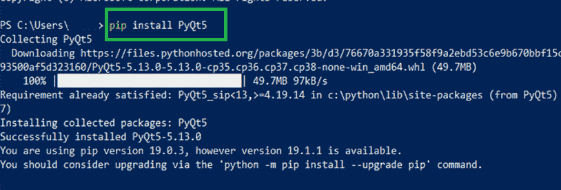

# 如何在 Windows 中安装 Python 的 PyQt？

> 原文:[https://www . geesforgeks . org/how-install-pyqt-for-python-in-window/](https://www.geeksforgeeks.org/how-to-install-pyqt-for-python-in-windows/)

在本文中，我们将了解在 Windows 中为 python 安装 PyQt 的分步过程。 **PyQt** 是跨平台 GUI 工具包 Qt 的 Python 绑定，作为 Python 插件实现。PyQt 是由英国河岸计算公司开发的自由软件。

### **PyQt 的特征:**

有 600 多个类别，涵盖一系列功能，例如:

*   图形用户界面
*   SQL 数据库
*   网络工具包
*   XML 处理
*   建立工作关系网

### 在 Windows 上安装 Python 的 PyQt:

按照以下步骤在 Windows 上安装 python 的 PyQt:

**步骤 1:** 验证系统上是否安装了 python。

在这里，用户可以简单地在命令提示符或 windows 的 power shell 中运行下面的命令，以验证系统中是否已经安装了 python。如果 python 已经安装在系统中，命令的输出将是 python 的运行版本，如果没有安装，它将产生一个错误。如果没有安装 python，用户可以参考[如何安装 Python](https://www.geeksforgeeks.org/how-to-install-python-on-windows/) 。

**检查 python 是否已经安装的命令:**

```
python --version
```

**输出:**



**步骤 2:** 验证之前没有安装 PyQt:

在这种情况下，用户只需键入下面的命令来验证以前是否安装了 PyQt，如果安装了，用户无需遵循下面提到的步骤。

**命令:**

```
pip list
```

**输出:**



**第三步**:安装 PyQt:

这里，这是用 python 安装 PyQt 的最后一步，用户只需键入下面提到的文章，PyQt5 将成功安装在系统中，并且通过重复步骤-2，用户可以验证 PyQt 是否已安装。

**命令:**

```
 pip install PyQt5
```

**输出:**



至此，您已经在 Windows 上成功安装了 python 的 PyQt。