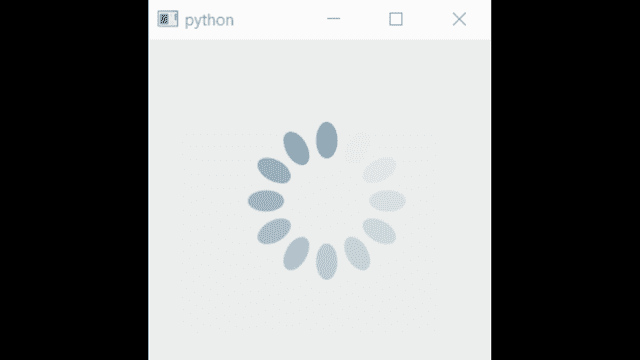

# 如何在 PyQT5 中制作加载 gif？

> 原文:[https://www . geesforgeks . org/如何制作加载 gif-in-pyqt5/](https://www.geeksforgeeks.org/how-to-make-a-loading-gif-in-pyqt5/)

[PyQt5](https://www.geeksforgeeks.org/python-introduction-to-pyqt5/) 是一个 **GUI 工具包**，可以用 Python 开发 GUI 应用。它提供了许多模块，可以帮助构建图形用户界面应用程序的各种组件。

### **安装:**

```py
pip install PyQt5
```

**Gif 链接:** [https://loading.io/](https://loading.io/)

### 方法:

*   导入模块
*   创建窗口和标签
*   加载 GIF
*   使用 Start()开始 GIF
*   添加使用 stop()停止 GIF 的机制
*   执行代码

**示例:**

## 蟒蛇 3

```py
import sys
from PyQt5 import QtCore, QtGui, QtWidgets
from PyQt5.QtGui import QMovie
from PyQt5.QtCore import Qt

class LoadingGif(object):

    def mainUI(self, FrontWindow):
        FrontWindow.setObjectName("FTwindow")
        FrontWindow.resize(320, 300)
        self.centralwidget = QtWidgets.QWidget(FrontWindow)
        self.centralwidget.setObjectName("main-widget")

        # Label Create
        self.label = QtWidgets.QLabel(self.centralwidget)
        self.label.setGeometry(QtCore.QRect(25, 25, 200, 200))
        self.label.setMinimumSize(QtCore.QSize(250, 250))
        self.label.setMaximumSize(QtCore.QSize(250, 250))
        self.label.setObjectName("lb1")
        FrontWindow.setCentralWidget(self.centralwidget)

        # Loading the GIF
        self.movie = QMovie("loader.gif")
        self.label.setMovie(self.movie)

        self.startAnimation()

    # Start Animation

    def startAnimation(self):
        self.movie.start()

    # Stop Animation(According to need)
    def stopAnimation(self):
        self.movie.stop()

app = QtWidgets.QApplication(sys.argv)
window = QtWidgets.QMainWindow()
demo = LoadingGif()
demo.mainUI(window)
window.show()
sys.exit(app.exec_())
```

**输出:**



gif 加载屏幕。