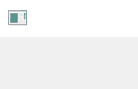
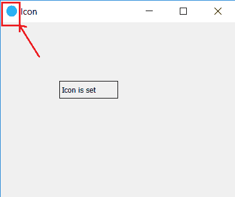

# 如何在 PyQt5 中给窗口设置图标？

> 原文:[https://www . geesforgeks . org/如何将图标设置为 pyqt5 中的窗口/](https://www.geeksforgeeks.org/how-to-set-icon-to-a-window-in-pyqt5/)

当我们设计 PyQt5 应用程序时，我们会在左上角看到一个图标，默认情况下，它看起来像这样:


在本教程中，我们将看到如何根据用户需要更改图标，为此，我们使用`setWindowIcon()`方法并加载属于`QtGui class`的图标`QIcon`。

> **语法:**setwindowicon(qtgui . qicon(' icon . png '))
> 
> **参数:**如果文件在同一个文件夹中，bIt 取文件名。

**代码:**

```
# importing the required libraries

from PyQt5.QtWidgets import * 
from PyQt5 import QtCore
from PyQt5 import QtGui
import sys

class Window(QMainWindow):
    def __init__(self):
        super().__init__()

        self.setWindowIcon(QtGui.QIcon('logo.png'))
        # set the title
        self.setWindowTitle("Icon")

        # setting  the geometry of window
        self.setGeometry(0, 0, 400, 300)

        # creating a label widget
        self.label = QLabel("Icon is set", self)

        # moving position
        self.label.move(100, 100)

        # setting up border
        self.label.setStyleSheet("border: 1px solid black;")

        # show all the widgets
        self.show()

# create pyqt5 app
App = QApplication(sys.argv)

# create the instance of our Window
window = Window()

# start the app
sys.exit(App.exec())
```

**输出:**
