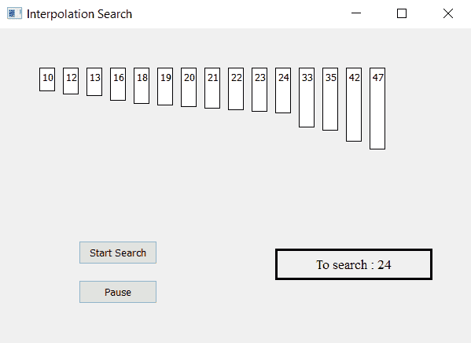

# 使用 PyQt5 的插值搜索可视化工具

> 原文:[https://www . geesforgeks . org/interpolation-search-visualizer-using-pyqt 5/](https://www.geeksforgeeks.org/interpolation-search-visualizer-using-pyqt5/)

在本文中，我们将看到如何制作一个 PyQt5 应用程序，它将可视化[插值搜索](https://www.geeksforgeeks.org/interpolation-search/)算法。
[**插值搜索**](https://www.geeksforgeeks.org/interpolation-search/) 是对[二分搜索法](https://www.geeksforgeeks.org/binary-search/)的改进，在这种情况下，排序数组中的值是均匀分布的。二分搜索法总是去中间元素检查。另一方面，根据被搜索的关键字的值，插值搜索可以去往不同的位置。例如，如果关键字的值更接近最后一个元素，插值搜索很可能开始向末端搜索。



> **GUI 实现步骤:**
> 1。根据给定的数字列表
> 2 创建标签列表。设置它们的文本、边框、颜色和几何图形，使它们彼此之间有各自的间隙
> 3。每个标签高度应与每个数字
> 4 的值成比例。创建开始和暂停按钮，开始搜索并暂停搜索
> 5。创建结果标签，显示搜索状态
> **后端实现步骤:**
> 1。创建对应于给定编号的标签列表
> 2。为较低、较高和位置索引创建变量并标记搜索
> 3。向按钮添加动作他们的动作应该改变标志状态，即开始动作应该使标志为真，暂停动作应该使标志为假。
> 4。创建定时器对象，该对象在每个特定时间后调用一个方法
> 5。在定时器方法内检查标志是否为真标志为真开始插值搜索算法
> 6。检查数值是否在范围内，如果没有，显示输出为未找到，否则继续
> 7。如果较低索引的索引大于较高索引，则停止搜索，并将结果显示为未找到
> 8。通过插值搜索公式
> 9 计算位置指数。检查所需值是否在位置索引处，如果匹配，则显示找到的结果
> 10。如果期望值不相等，则根据期望值更新较低和较高的索引。

下面是实现

## 蟒蛇 3

```py
# importing libraries
from PyQt5.QtWidgets import *
from PyQt5 import QtCore, QtGui
from PyQt5.QtGui import *
from PyQt5.QtCore import *
import sys

class Window(QMainWindow):

    # list of numbers
    number = [10, 12, 13, 16, 18, 19, 20, 21,
                  22, 23, 24, 33, 35, 42, 47]

    # desired value
    desired = 24
    def __init__(self):
        super().__init__()

        # setting title
        self.setWindowTitle("Interpolation Search ")

        # setting geometry
        self.setGeometry(100, 100, 600, 400)

        # calling method
        self.UiComponents()

        # showing all the widgets
        self.show()

    # method for widgets
    def UiComponents(self):

        # start flag
        self.start = False

        # list to hold labels
        self.label_list = []

        # position for keeping index
        self.position = 0

        # lower index
        self.lo = 0

        # higher index
        self.hi = len(self.number) - 1

        # local counter
        c = 0

        # iterating list of numbers
        for i in self.number:

            # creating label for each number
            label = QLabel(str(i), self)

            # adding background color and border
            label.setStyleSheet("border : 1px solid black;
                                 background : white;")

            # aligning the text
            label.setAlignment(Qt.AlignTop)

            # setting geometry using local counter
            # first parameter is distance from left
            # and second is distance from top
            # third is width and forth is height
            label.setGeometry(50 + c * 30, 50, 20, i * 2 + 10)

            # adding label to the label list
            self.label_list.append(label)

            # incrementing local counter
            c = c + 1

        # creating push button to start the search
        self.search_button = QPushButton("Start Search", self)

        # setting geometry of the button
        self.search_button.setGeometry(100, 270, 100, 30)

        # adding action to the search button
        self.search_button.clicked.connect(self.search_action)

        # creating push button to pause the search
        pause_button = QPushButton("Pause", self)

        # setting geometry of the button
        pause_button.setGeometry(100, 320, 100, 30)

        # adding action to the search button
        pause_button.clicked.connect(self.pause_action)

        # creating label to show the result
        self.result = QLabel("To search : " + str(self.desired), self)

        # setting geometry
        self.result.setGeometry(350, 280, 200, 40)

        # setting style sheet
        self.result.setStyleSheet("border : 3px solid black;")

        # adding font
        self.result.setFont(QFont('Times', 10))

        # setting alignment
        self.result.setAlignment(Qt.AlignCenter)

        # creating a timer object
        timer = QTimer(self)

        # adding action to timer
        timer.timeout.connect(self.showTime)

        # update the timer every 200 millisecond
        timer.start(200)

    # method called by timer
    def showTime(self):

        # checking if flag is true
        if self.start:

            # Interpolation Search
            # checking if desired number is with in the range
            if (self.desired < self.number[self.lo] or
                  self.desired > self.number[self.hi]):

                # make flag false
                self.start = False
                # show result as not found
                self.result.setText("Not Found")

            # if lower index become greater then higher index
            if self.lo > self.hi:

                # make flag false
                self.start = False
                # show result as not found
                self.result.setText("Not Found")

            else:
                # lower index is equal to higher index
                if self.lo == self.hi:

                    # checking if it matches desired value
                    if self.number[self.lo] == self.desired:

                        # show result
                        self.result.setText("Found at index : " + str(self.lo))
                        # make result label color green
                        self.label_list[self.lo].setStyleSheet(
                                     "border : 2px solid green;"
                                     "background-color : lightgreen;")

                    else:
                        # make result color grey
                        self.label_list[self.lo].setStyleSheet(
                                     "border : 1px solid black;"
                                     "background-color : grey;")

                # Probing the position with keeping
                # uniform distribution in mind.
                self.position = self.lo + int(((float(self.hi - self.lo) /
                        ( self.number[self.hi] - self.number[self.lo])) *
                          (self.desired - self.number[self.lo])))

                # checking if the position matches with desired value position
                if self.number[self.position] == self.desired:

                    # make flag false
                    self.start = False

                    # show result and make label color green
                    self.result.setText("Found at position : " + str(self.position))
                    self.label_list[self.position].setStyleSheet(
                                        "border : 2px solid green;"
                                        "background-color : lightgreen;")

                else:

                    # make label color grey
                    self.label_list[self.position].setStyleSheet(
                                      "border : 1px solid black;"
                                      "background-color : grey;")

                # If desired is larger, desired is in upper part
                if self.number[self.position] < self.desired:
                    # updating lowe index
                    self.lo = self.position + 1

                # If desired is smaller, desired is in lower part
                else:
                    # updating higher index
                    self.hi = self.position - 1

    # method called by search button
    def search_action(self):

        # making flag true
        self.start = True

        # showing text in result label
        self.result.setText("Started searching...")

    # method called by pause button
    def pause_action(self):

        # making flag false
        self.start = False

        # showing text in result label
        self.result.setText("Paused")

# create pyqt5 app
App = QApplication(sys.argv)

# create the instance of our Window
window = Window()

# start the app
sys.exit(App.exec())
```

**输出:**

<video class="wp-video-shortcode" id="video-406352-1" width="640" height="360" preload="metadata" controls=""><source type="video/mp4" src="https://media.geeksforgeeks.org/wp-content/uploads/20200421000437/Interpolation-Search-20-04-2020-23_47_59.mp4?_=1">[https://media.geeksforgeeks.org/wp-content/uploads/20200421000437/Interpolation-Search-20-04-2020-23_47_59.mp4](https://media.geeksforgeeks.org/wp-content/uploads/20200421000437/Interpolation-Search-20-04-2020-23_47_59.mp4)</video>