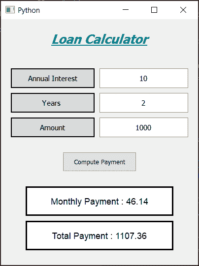

# Python 中使用 PyQt5 的贷款计算器

> 原文:[https://www . geesforgeks . org/loan-calculator-using-pyqt 5-in-python/](https://www.geeksforgeeks.org/loan-calculator-using-pyqt5-in-python/)

在本文中，我们将看到如何使用 [PyQt5](https://www.geeksforgeeks.org/python-introduction-to-pyqt5/) 创建贷款计算器，下图显示了贷款计算器的外观:



**PyQt5** 是跨平台的 GUI 工具包，一套针对 Qt v5 的 python 绑定。由于这个库
提供的工具和简单性，人们可以非常容易地开发交互式桌面应用程序

> **GUI 实现步骤:**
> 1。创建显示计算器名称
> 2 的标题标签。为利率创建标签和行编辑对，标签显示用户必须输入的内容，行编辑输入文本
> 3。同样，为年数和金额
> 4 创建一对。创建一个按钮来计算
> 5。创建一个标签来显示计算出的每月付款
> 6。创建一个标签来显示计算的总金额

> **后端实现步骤** :
> 1。使行编辑仅接受数字作为输入
> 2。给按钮增加动作
> 3。在按钮动作内获取行编辑的文本
> 4。检查行编辑文本是否为空或零，然后返回，以便该功能不再执行
> 5。将文本值转换为整数
> 6。计算每月金额，并将该值设置到标签
> 7 上。根据每月金额计算总金额，并通过标签显示该值

下面是实现:

## 蟒蛇 3

```
# importing required libraries
from PyQt5.QtWidgets import *
from PyQt5 import QtCore, QtGui
from PyQt5.QtGui import *
from PyQt5.QtCore import *

import sys

class Window(QMainWindow):

    # constructor
    def __init__(self):
        super().__init__()

        # setting title
        self.setWindowTitle("Python ")

        # width of window
        self.w_width = 400

        # height of window
        self.w_height = 500

        # setting geometry
        self.setGeometry(100, 100, self.w_width, self.w_height)

        # calling method
        self.UiComponents()

        # showing all the widgets
        self.show()

    # method for adding components
    def UiComponents(self):
        # creating head label
        head = QLabel("Loan Calculator", self)

        # setting geometry to the head
        head.setGeometry(0, 10, 400, 60)

        # font
        font = QFont('Times', 15)
        font.setBold(True)
        font.setItalic(True)
        font.setUnderline(True)

        # setting font to the head
        head.setFont(font)

        # setting alignment of the head
        head.setAlignment(Qt.AlignCenter)

        # setting color effect to the head
        color = QGraphicsColorizeEffect(self)
        color.setColor(Qt.darkCyan)
        head.setGraphicsEffect(color)

        # creating a interest label
        i_label = QLabel("Annual Interest", self)

        # setting properties to the interest label
        i_label.setAlignment(Qt.AlignCenter)
        i_label.setGeometry(20, 100, 170, 40)
        i_label.setStyleSheet("QLabel"
                              "{"
                              "border : 2px solid black;"
                              "background : rgba(70, 70, 70, 35);"
                              "}")
        i_label.setFont(QFont('Times', 9))

        # creating a QLineEdit object to get the interest
        self.rate = QLineEdit(self)

        # accepting only number as input
        onlyInt = QIntValidator()
        self.rate.setValidator(onlyInt)

        # setting properties to the rate line edit
        self.rate.setGeometry(200, 100, 180, 40)
        self.rate.setAlignment(Qt.AlignCenter)
        self.rate.setFont(QFont('Times', 9))

        # creating a number of years label
        n_label = QLabel("Years ", self)

        # setting properties to the years label
        n_label.setAlignment(Qt.AlignCenter)
        n_label.setGeometry(20, 150, 170, 40)
        n_label.setStyleSheet("QLabel"
                              "{"
                              "border : 2px solid black;"
                              "background : rgba(70, 70, 70, 35);"
                              "}")
        n_label.setFont(QFont('Times', 9))

        # creating a QLineEdit object to get the years
        self.years = QLineEdit(self)

        # accepting only number as input
        onlyInt = QIntValidator()
        self.years.setValidator(onlyInt)

        # setting properties to the rate line edit
        self.years.setGeometry(200, 150, 180, 40)
        self.years.setAlignment(Qt.AlignCenter)
        self.years.setFont(QFont('Times', 9))

        # creating a loan amount label
        a_label = QLabel("Amount", self)

        # setting properties to the amount label
        a_label.setAlignment(Qt.AlignCenter)
        a_label.setGeometry(20, 200, 170, 40)
        a_label.setStyleSheet("QLabel"
                              "{"
                              "border : 2px solid black;"
                              "background : rgba(70, 70, 70, 35);"
                              "}")
        a_label.setFont(QFont('Times', 9))

        # creating a QLineEdit object to get the amount
        self.amount = QLineEdit(self)

        # accepting only number as input
        onlyInt = QIntValidator()
        self.amount.setValidator(onlyInt)

        # setting properties to the rate line edit
        self.amount.setGeometry(200, 200, 180, 40)
        self.amount.setAlignment(Qt.AlignCenter)
        self.amount.setFont(QFont('Times', 9))

        # creating a push button
        calculate = QPushButton("Compute Payment", self)

        # setting geometry to the push button
        calculate.setGeometry(125, 270, 150, 40)

        # adding action to the calculate button
        calculate.clicked.connect(self.calculate_action)

        # creating a label to show monthly payment
        self.m_payment = QLabel(self)

        # setting properties to m payment label
        self.m_payment.setAlignment(Qt.AlignCenter)
        self.m_payment.setGeometry(50, 340, 300, 60)
        self.m_payment.setStyleSheet("QLabel"
                                     "{"
                                     "border : 3px solid black;"
                                     "background : white;"
                                     "}")
        self.m_payment.setFont(QFont('Arial', 11))

        # creating a label to show monthly payment
        self.y_payment = QLabel(self)

        # setting properties to y payment label
        self.y_payment.setAlignment(Qt.AlignCenter)
        self.y_payment.setGeometry(50, 410, 300, 60)
        self.y_payment.setStyleSheet("QLabel"
                                     "{"
                                     "border : 3px solid black;"
                                     "background : white;"
                                     "}")
        self.y_payment.setFont(QFont('Arial', 11))

    # method for calculating monthly 
    # and annually payments
    def calculate_action(self):

        # getting annual interest rate
        annualInterestRate = self.rate.text()

        # if there is no number is entered
        if len(annualInterestRate) == 0 or annualInterestRate == '0':
            return

        # getting number of years
        numberOfYears = self.years.text()

        # if there is no number is entered
        if len(numberOfYears) == 0 or numberOfYears == '0':
            return

        # getting loan amount
        loanAmount = self.amount.text()

        # if there is no number is entered
        if len(loanAmount) == 0 or loanAmount == '0':
            return

        # converting text to int
        annualInterestRate = int(annualInterestRate)
        numberOfYears = int(numberOfYears)
        loanAmount = int(loanAmount)

        # getting monthly interest rate
        monthlyInterestRate = annualInterestRate / 1200

        # calculating monthly payemnt
        monthlyPayment = loanAmount * monthlyInterestRate / (1 - 1 / (1 + monthlyInterestRate) ** (numberOfYears * 12))

        # setting formatting
        monthlyPayment = "{:.2f}".format(monthlyPayment)

        # setting text to the label
        self.m_payment.setText("Monthly Payment : " + str(monthlyPayment))

        # getting total payment
        totalPayment = float(monthlyPayment) * 12 * numberOfYears
        totalPayment = "{:.2f}".format(totalPayment)

        # setting text to the label
        self.y_payment.setText("Total Payment : " + str(totalPayment))

# create pyqt5 app
App = QApplication(sys.argv)

# create the instance of our Window
window = Window()

# start the app
sys.exit(App.exec())
```

**输出:**

<video class="wp-video-shortcode" id="video-435404-1" width="640" height="360" preload="metadata" controls=""><source type="video/mp4" src="https://media.geeksforgeeks.org/wp-content/uploads/20200613034239/Python-2020-06-13-03-42-12.mp4?_=1">[https://media.geeksforgeeks.org/wp-content/uploads/20200613034239/Python-2020-06-13-03-42-12.mp4](https://media.geeksforgeeks.org/wp-content/uploads/20200613034239/Python-2020-06-13-03-42-12.mp4)</video>