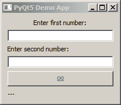

# 将 PyQt5 应用迁移到 PySide2

> 原文:[https://www.geeksforgeeks.org/migrate-pyqt5-app-to-pyside2/](https://www.geeksforgeeks.org/migrate-pyqt5-app-to-pyside2/)

Python 中最先进的 Gui 开发包之一是 PyQt5。根据 Pyside2 的维护者 Christian Tismer 的说法，PyQt5 有大约 25，000 个功能供您使用。那是一个非常大的图书馆。然而，如果你想商业分发你的应用，你需要从 Qt 公司购买许可证。幸运的是，PySide2 给了你和自由软件一样的自由。

让我们看看如何将典型的 PyQt5 应用程序迁移到 PySide2。

```py
import sys
from PyQt5.QtWidgets import (QGridLayout)
from PyQt5.QtWidgets import (QMainWindow)
from PyQt5.QtWidgets import (QApplication)
from PyQt5.QtWidgets import (
                                QWidget,
                                QPushButton,
                                QLabel,
                                QLineEdit
                            )

from PyQt5.QtCore import Qt
from PyQt5.QtGui import (QPixmap,QIcon)

class Window(QMainWindow):

    def __init__(self, parent = None):
        super().__init__(parent)
        self.setWindowTitle('PyQt5 Demo App')
        self.initGui()

    def initGui(self):
        self.layout = QGridLayout()
        self.window = QWidget()
        self.window.setLayout(self.layout)
        self.setCentralWidget(self.window)

        self.num1_label = QLabel('Enter first number:')
        self.num1_label.setAlignment(Qt.AlignCenter)
        self.text_box1 = QLineEdit()
        self.num2_label = QLabel('Enter second number:')
        self.text_box2 = QLineEdit()

        self.get_answer = QPushButton()
        calculate_icon = QPixmap('path_to_image.png')
        self.get_answer.setIcon(QIcon(calculate_icon))

        self.answer_label = QLabel('---')

        self.layout.addWidget(self.num1_label, 0, 0)
        self.layout.addWidget(self.text_box1, 1, 0)
        self.layout.addWidget(self.num2_label, 2, 0)
        self.layout.addWidget(self.text_box2, 3, 0)
        self.layout.addWidget(self.get_answer, 4, 0)
        self.layout.addWidget(self.answer_label, 5, 0)

if __name__ == '__main__':
    app = QApplication(sys.argv)

    win = Window()
    win.show()

    sys.exit(app.exec_())
```

**输出:**


我们特意使用了一个使用 *QtWidget* 、 *QtCore* 和 *QtGui* 的例子。要做的一件事就是好好练习。是关于避免`from X import *`。命名我们的导入有一个优势，那就是了解什么属于什么模块。

```py
import sys

from PyQt5 import QtWidgets
from PyQt5 import QtCore
from PyQt5 import QtGui
```

现在，将我们的代码更改为下面的代码，其中我们命名了我们的导入。 *QMainWindow* 变成 *QtWidgets。QMainWindow* 等等–

```py
class Window(QtWidgets.QMainWindow):

    def __init__(self, parent = None):
        super().__init__(parent)
        self.setWindowTitle('PyQt5 Demo App')
        self.initGui()

    def initGui(self):
        self.layout = QtWidgets.QGridLayout()
        self.window = QtWidgets.QWidget()
        self.window.setLayout(self.layout)
        self.setCentralWidget(self.window)

        self.num1_label = QtWidgets.QLabel('Enter first number:')
        self.num1_label.setAlignment(QtCore.Qt.AlignCenter)
        self.text_box1 = QtWidgets.QLineEdit()
        self.num2_label = QtWidgets.QLabel('Enter second number:')
        self.text_box2 = QtWidgets.QLineEdit()

        self.get_answer = QtWidgets.QPushButton()
        calculate_icon = QtGui.QPixmap('path_to_image.png')
        self.get_answer.setIcon(QtGui.QIcon(calculate_icon))

        self.answer_label = QtWidgets.QLabel('---')

        self.layout.addWidget(self.num1_label, 0, 0)
        self.layout.addWidget(self.text_box1, 1, 0)
        self.layout.addWidget(self.num2_label, 2, 0)
        self.layout.addWidget(self.text_box2, 3, 0)
        self.layout.addWidget(self.get_answer, 4, 0)
        self.layout.addWidget(self.answer_label, 5, 0)

if __name__ == '__main__':
    app = QtWidgets.QApplication(sys.argv)

    win = Window()
    win.show()

    sys.exit(app.exec_())
```

**转换为 Pyside2**

将我们的应用程序转换为 PySide2 就像将我们的导入更改为

```py
import sys

from PySide2 import QtWidgets
from PySide2 import QtCore
from PySide2 import QtGui
```

## 注意事项–

对于大多数用途，迁移意味着调整导入、定义函数和仅使用支持的函数。

1.  需要注意的是 *app.exec_* 。 *exec_* 用作 *exec* 是一个 Python2 关键字。在 Python3 下，PyQt5 允许使用 *exec* ，但不允许使用 PySide2。PyQt5 同时支持`sys.exit(app.exec_())`和`sys.exit(app.exec())`，但是 PySide2 只支持`app.exec_()`。
2.  第二件事是信号和插槽。在 PyQt5 下是`QtCore.pyqtSignal`和`QtCore.pyqtSlot`，在 PySide2 下是`QtCore.Signal`和`QtCore.Slot`。
3.  第三件事是加载 Ui 文件。