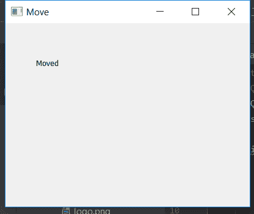

# 在 PyQt5 中移动()方法

> 原文:[https://www.geeksforgeeks.org/move-method-in-pyqt5/](https://www.geeksforgeeks.org/move-method-in-pyqt5/)

为了移动(改变位置)，在 PyQt5 应用程序中使用任何小部件，如按钮或标签`**move()**`方法。默认情况下，所有小部件都位于左上角，因此需要更改小部件的位置。

> **语法:**移动(x，y)
> 
> **论据:**需要两个论据:
> 1。x 坐标
> 2。y 坐标

下面是这个方法的实现。

```
# importing the required libraries
from PyQt5.QtGui import * 
from PyQt5.QtWidgets import * 
import sys

class Window(QMainWindow):
    def __init__(self):
        super().__init__()

        # set the title
        self.setWindowTitle("Move")

        # setting  the geometry of window
        self.setGeometry(0, 0, 400, 300)

        # creating a label widget
        self.widget = QLabel('Moved', self)

        # moving the widget
        # move(left, top)
        self.widget.move(50, 50)

        # show all the widgets
        self.show()

# create pyqt5 app
App = QApplication(sys.argv)

# create the instance of our Window
window = Window()
# start the app
sys.exit(App.exec())
```

**输出:**
