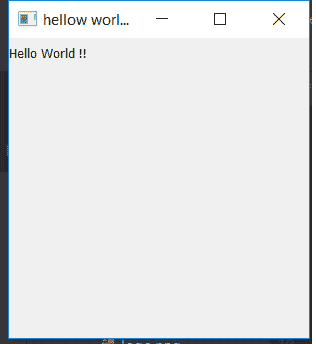

# PyQt Hello World

> 原文:[https://www.geeksforgeeks.org/pyqt-hello-world/](https://www.geeksforgeeks.org/pyqt-hello-world/)

Python 提供了这么多开发 GUI 应用程序的选项，PyQt5 就是其中之一。PyQt5 是跨平台的 GUI 工具包，是一组针对 Qt v5 的 python 绑定。由于该库提供的工具和简单性，人们可以非常容易地开发交互式桌面应用程序。

**安装:**

```
pip install PyQt5
```

在这篇文章中，我们将看到如何制作一个简单的 PyQt5 应用程序，打印消息“你好，世界！”

**代号:**

```
# importing the required libraries
from PyQt5.QtWidgets import * 
import sys

class Window(QMainWindow):
    def __init__(self):
        super().__init__()

        # set the title
        self.setWindowTitle("hellow world !")

        # set the geometry
        self.setGeometry(0, 0, 300, 300)

        # create label widget
        # to display content on screen
        self.label = QLabel("Hello World !!", self)

        # show all the widgets
        self.show()

# create pyqt5 app
App = QApplication(sys.argv)

# create the instance of our Window
window = Window()

# start the app
sys.exit(App.exec())
```

**输出:**


**说明:**
首先我们创建了继承`QMainWindow`类的`Window`类。在这个类中，我们可以添加显示在主窗口上的小部件，我们使用了`setWindowTiltle`方法来设置标题。`setGeometry`设置窗口大小和位置以及显示信息的方法我们使用了`QLabel`。