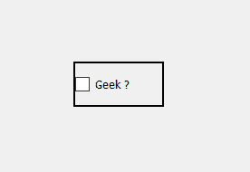
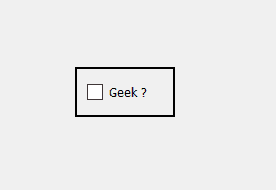
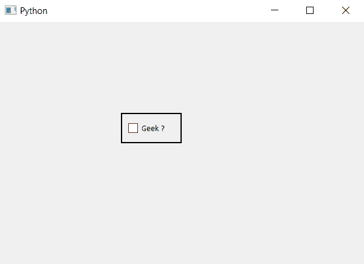

# PyQt–复选框的填充

> 原文:[https://www.geeksforgeeks.org/pyqt-padding-of-checkbox/](https://www.geeksforgeeks.org/pyqt-padding-of-checkbox/)

在本文中，我们将看到如何为复选框设置填充。填充基本上是边框和内容之间的空间。默认情况下没有填充空间，但是在样式表的帮助下，我们可以为复选框设置填充。
下面是普通复选框和有填充的复选框的图示。

 

样式表代码来实现这一点。

```py
QCheckBox
{
border : 2px solid black;
padding : 10px;
}
```

**下面是实现–**

## 蟒蛇 3

```py
# importing libraries
from PyQt5.QtWidgets import *
from PyQt5 import QtCore, QtGui
from PyQt5.QtGui import *
from PyQt5.QtCore import *
import sys

class Window(QMainWindow):

    def __init__(self):
        super().__init__()

        # setting title
        self.setWindowTitle("Python ")

        # setting geometry
        self.setGeometry(100, 100, 600, 400)

        # calling method
        self.UiComponents()

        # showing all the widgets
        self.show()

    # method for widgets
    def UiComponents(self):
        # creating the check-box
        checkbox = QCheckBox('Geek ?', self)

        # setting tristate check box
        checkbox.setTristate(True)

        # setting geometry of check box
        checkbox.setGeometry(200, 150, 100, 50)

        # adding border to the check box
        # and padding
        checkbox.setStyleSheet("QCheckBox"
                               "{"
                               "border : 2px solid black;"
                               "padding : 10px;"
                               "}")

# create pyqt5 app
App = QApplication(sys.argv)

# create the instance of our Window
window = Window()

# start the app
sys.exit(App.exec())
```

**输出:**

