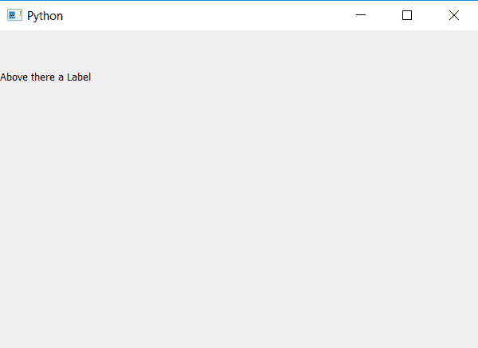

# PyQt–设置标签的可见方法

> 原文:[https://www . geesforgeks . org/pyqt-set visible-method-for-label/](https://www.geeksforgeeks.org/pyqt-setvisible-method-for-label/)

在本文中，我们将看到关于`setVisible`的内容，它类似于`hide()`方法。`setVisible()`方法以 *bool* 为参数，设置标签的可见性。默认情况下，它设置为“真”。

> **语法:** label.setVisible(True)
> 
> **自变量:**它以 bool 为自变量。
> 
> **执行的动作。**
> 如果传递给它的是 False，标签将不可见
> 如果传递给它的是 True，标签将可见

**代码:**

```py
# importing the required libraries

from PyQt5.QtCore import * 
from PyQt5.QtGui import * 
from PyQt5.QtWidgets import * 
import sys

class Window(QMainWindow):
    def __init__(self):
        super().__init__()

        # set the title
        self.setWindowTitle("Python")

        # setting geometry
        self.setGeometry(100, 100, 600, 400)
        # creating a label widget
        self.label_1 = QLabel("Label", self)

        # moving position
        self.label_1.move(0, 0)

        # setting up the border
        self.label_1.setStyleSheet("border :3px solid black;")

        # setting visibility status
        self.label_1.setVisible(False)

        # creating a label widget
        self.label_2 = QLabel("Above there a Label", self)

        # moving position
        self.label_2.move(0, 50)

        # adjust size
        self.label_2.adjustSize()

        # show all the widgets
        self.show()

# create pyqt5 app
App = QApplication(sys.argv)

# create the instance of our Window
window = Window()

# start the app
sys.exit(App.exec())
```

**输出:**
