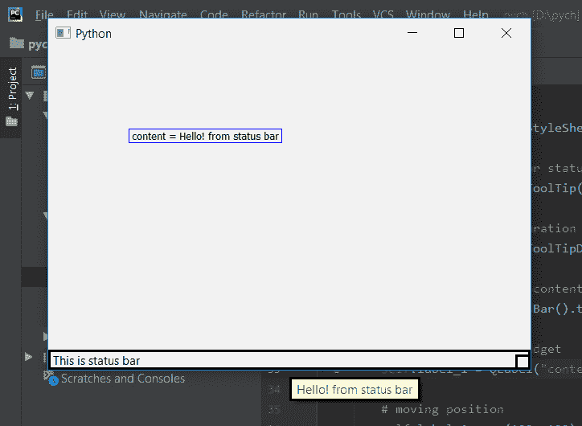

# PyQt5–访问状态栏

的工具提示数据

> 原文:[https://www . geesforgeks . org/pyqt 5-访问-工具-提示-状态条数据/](https://www.geeksforgeeks.org/pyqt5-access-tool-tip-data-of-status-bar/)

我们知道借助状态栏对象我们可以设置工具提示。在本文中，我们将了解如何访问工具提示内容。为此，我们将对状态栏对象使用`toolTip`方法。

> **语法：** self.statusBar（）.toolTip（）
> 
> **论证:**不需要论证。
> 
> **返回:**返回引用状态栏工具提示内容的字符串。

**代码:**

```
# importing libraries
from PyQt5.QtCore import * 
from PyQt5.QtGui import * 
from PyQt5.QtWidgets import * 
import sys

class Window(QMainWindow):
    def __init__(self):
        super().__init__()

        # set the title
        self.setWindowTitle("Python")

        # setting  the geometry of window
        self.setGeometry(60, 60, 600, 400)

        # setting status bar message
        self.statusBar().showMessage("This is status bar")

        # setting  border
        self.statusBar().setStyleSheet("border :3px solid black;")

        # setting tool tip for status bar
        self.statusBar().setToolTip("Hello ! from status bar")

        # setting tool tip duration
        self.statusBar().setToolTipDuration(500)

        # accessing tool tip content
        content = self.statusBar().toolTip()

        # creating a label widget
        self.label_1 = QLabel("content = " + content, self)

        # moving position
        self.label_1.move(100, 100)

        # setting up the border
        self.label_1.setStyleSheet("border :1px solid blue;")

        # resizing label
        self.label_1.adjustSize()

        # show all the widgets
        self.show()

# create pyqt5 app
App = QApplication(sys.argv)

# create the instance of our Window
window = Window()

# start the app
sys.exit(App.exec())
```

**输出:**
