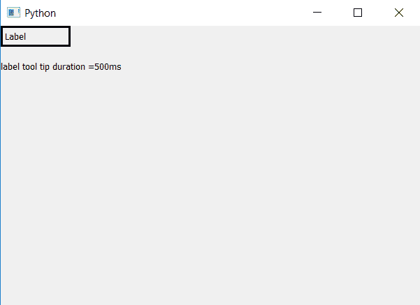

# PyQt5–访问标签的工具提示持续时间|工具提示持续时间方法

> 原文:[https://www . geesforgeks . org/pyqt 5-access-tool-tip-duration-label-tool tip duration-method/](https://www.geeksforgeeks.org/pyqt5-access-tool-tip-duration-of-label-tooltipduration-method/)

PyQt5 为用户提供了使用`setToolTip()`方法制作工具提示的功能，我们也可以使用`setToolTipDuration()`方法为其设置持续时间，在本文中，我们将看到如何访问标签工具提示的持续时间，为此我们将使用`ToolTipDuration()`方法。

> **语法:**标签。工具提示持续时间()
> 
> **论证:**不需要论证。
> 
> **返回:**返回整数，指毫秒。

**代码:**

```
# importing the required libraries

from PyQt5.QtCore import * 
from PyQt5.QtGui import * 
from PyQt5.QtWidgets import * 
import sys

class Window(QMainWindow):
    def __init__(self):
        super().__init__()

        # set the title
        self.setWindowTitle("Python")

        # setting geometry
        self.setGeometry(100, 100, 600, 400)
        # creating a label widget
        self.label_1 = QLabel("Label", self)

        # moving position
        self.label_1.move(0, 0)

        # setting up the border
        self.label_1.setStyleSheet("border :3px solid black;")

        # setting label tool tip
        self.label_1.setToolTip("It is for 5 seconds")

        # setting time duration
        self.label_1.setToolTipDuration(500)

        # getting tool tip duration
        t = str(self.label_1.toolTipDuration())

        # creating a label widget
        self.label_2 = QLabel("label tool tip duration =" + t + "ms", self)

        # moving position
        self.label_2.move(0, 50)

        # adjust size
        self.label_2.adjustSize()

        # show all the widgets
        self.show()

# create pyqt5 app
App = QApplication(sys.argv)

# create the instance of our Window
window = Window()

# start the app
sys.exit(App.exec())
```

**输出:**
