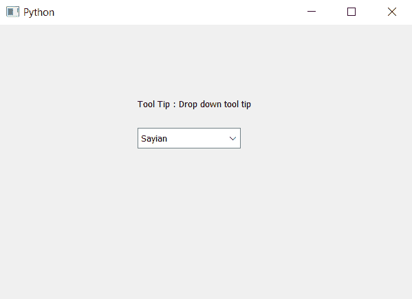

# PyQt5–访问组合框

的视图工具提示(下拉)

> 原文:[https://www . geesforgeks . org/pyqt 5-access-tooltip-of-view-down-of-combobox/](https://www.geeksforgeeks.org/pyqt5-access-tooltip-of-viewdrop-down-of-combobox/)

在本文中，我们将看到如何访问组合框下拉部分的工具提示。当我们将工具提示设置为组合框时，它只显示线编辑部分，工具提示对于下拉部分(即其视图部分)不可见。

> **要访问视图零件的工具提示，请执行以下实施步骤–**
> 
> 1.创建组合框
> 2。向组合框
> 3 添加项目。获取组合框
> 4 的视图对象。向视图对象添加工具提示
> 5。获取视图对象的工具提示，并将其存储在变量
> 6 中。创建标签以显示工具提示

**语法:**

```
# getting view part of combo box
view = self.combo_box.view()

# setting tool tip to view object of the combo box
view.setToolTip(tip)

# accessing tool tip 
get_tip = view.toolTip()

```

以下是实施–

```
# importing libraries
from PyQt5.QtWidgets import * 
from PyQt5 import QtCore, QtGui
from PyQt5.QtGui import * 
from PyQt5.QtCore import * 
import sys

class Window(QMainWindow):

    def __init__(self):
        super().__init__()

        # setting title
        self.setWindowTitle("Python ")

        # setting geometry
        self.setGeometry(100, 100, 600, 400)

        # calling method
        self.UiComponents()

        # showing all the widgets
        self.show()

    # method for widgets
    def UiComponents(self):

        # creating a combo box widget
        self.combo_box = QComboBox(self)

        # setting geometry of combo box
        self.combo_box.setGeometry(200, 150, 150, 30)

        # geek list
        geek_list = ["Sayian", "Super Sayian", "Super Sayian 2", "Super Sayian B"]

        # making it editable
        self.combo_box.setEditable(True)

        # adding list of items to combo box
        self.combo_box.addItems(geek_list)

        # tool tip
        tip = "Drop down tool tip"

        # getting view part of combo box
        view = self.combo_box.view()

        # setting tool tip to view object of the combo box
        view.setToolTip(tip)

        # setting tool tip duration to view object
        view.setToolTipDuration(2000)

        # getting the tool tip
        get_tip = view.toolTip()

        # creating label to show the tool tip duration
        label = QLabel("Tool Tip : " + get_tip, self)

        # setting geometry of the label
        label.setGeometry(200, 100, 300, 30)

# create pyqt5 app
App = QApplication(sys.argv)

# create the instance of our Window
window = Window()

# start the app
sys.exit(App.exec())
```

**输出:**
