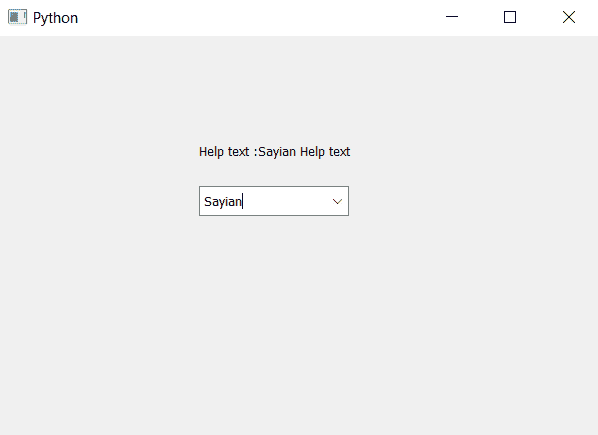

# PyQt5–访问组合框的帮助文本

> 原文:[https://www . geesforgeks . org/pyqt 5-访问帮助-组合框文本/](https://www.geeksforgeeks.org/pyqt5-accessing-help-text-of-the-combo-box/)

在本文中，我们将看到如何访问组合框的帮助文本。帮助文本基本上是用来告诉程序员关于紧急情况的信息，如参考链接等，程序员为组合框设置帮助文本，这样当其他程序员理解组合框有困难时，他/她可以从帮助文本中获得帮助。

为了给组合框设置帮助文本，我们使用`setWhatsThis`方法，为了访问帮助文本，我们使用`whatsThis`方法。

> **语法:** combo_box.whatsThis()
> 
> **论证:**不需要论证
> 
> **返回:**返回字符串

下面是实现

```py
# importing libraries
from PyQt5.QtWidgets import * 
from PyQt5 import QtCore, QtGui
from PyQt5.QtGui import * 
from PyQt5.QtCore import * 
import sys

class Window(QMainWindow):

    def __init__(self):
        super().__init__()

        # setting title
        self.setWindowTitle("Python ")

        # setting geometry
        self.setGeometry(100, 100, 600, 400)

        # calling method
        self.UiComponents()

        # showing all the widgets
        self.show()

    # method for widgets
    def UiComponents(self):

        # creating a combo box widget
        self.combo_box = QComboBox(self)

        # setting geometry of combo box
        self.combo_box.setGeometry(200, 150, 150, 30)

        # geek list
        geek_list = ["Sayian", "Super Sayian"]

        # making it editable
        self.combo_box.setEditable(True)

        # adding list of items to combo box
        self.combo_box.addItems(geek_list)

        # help text
        help = "Sayian Help text"

        # setting help text to the combo box
        self.combo_box.setWhatsThis(help)

        # getting the help text
        get_help = self.combo_box.whatsThis()

        # creating label to show the help text
        label = QLabel("Help text :" + get_help, self)

        # setting geometry of the label
        label.setGeometry(200, 100, 200, 30)

# create pyqt5 app
App = QApplication(sys.argv)

# create the instance of our Window
window = Window()

# start the app
sys.exit(App.exec())
```

**输出:**
