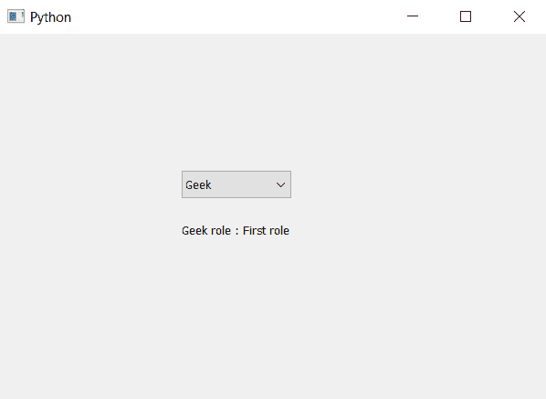

# PyQt5–访问组合框中项目的角色

> 原文:[https://www . geesforgeks . org/pyqt 5-访问-组合框中项目的角色/](https://www.geeksforgeeks.org/pyqt5-accessing-role-of-item-in-combobox/)

在本文中，我们将看到如何访问组合框中的项目角色。默认情况下，当我们创建一个组合框并向其中添加项目时，没有为这些项目设置任何角色。为了设置角色，我们使用`setItemData`方法，为了访问角色，我们使用`itemData`方法。

> **语法:**组合框.项目数据(索引)
> 
> **自变量:**以整数为自变量
> 
> **返回:**将返回字符串即角色

以下是实施–

```py
# importing libraries
from PyQt5.QtWidgets import * 
from PyQt5 import QtCore, QtGui
from PyQt5.QtGui import * 
from PyQt5.QtCore import * 
import sys

class Window(QMainWindow):

    def __init__(self):
        super().__init__()

        # setting title
        self.setWindowTitle("Python ")

        # setting geometry
        self.setGeometry(100, 100, 600, 400)

        # calling method
        self.UiComponents()

        # showing all the widgets
        self.show()

    # method for widgets
    def UiComponents(self):

        # creating a combo box widget
        self.combo_box = QComboBox(self)

        # setting geometry of combo box
        self.combo_box.setGeometry(200, 150, 120, 30)

        # geek list
        geek_list = ["Geek", "Geeky Geek", "Legend Geek", "Ultra Legend Geek"]

        # adding list of items to combo box
        self.combo_box.addItems(geek_list)

        # setting roles to the items
        self.combo_box.setItemData(0, "First role")
        self.combo_box.setItemData(1, "Second role")
        self.combo_box.setItemData(2, "Third role")
        self.combo_box.setItemData(3, "Forth role")

        # getting role
        role = self.combo_box.itemData(0)

        # creating label to print the role
        label = QLabel("Geek role : " + role, self)

        # setting geometry
        label.setGeometry(200, 200, 150, 30)

# create pyqt5 app
App = QApplication(sys.argv)

# create the instance of our Window
window = Window()

# start the app
sys.exit(App.exec())
```

**输出:**
