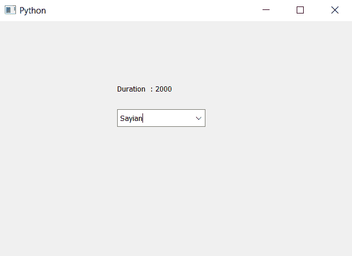

# PyQt5–访问组合框的工具提示持续时间

> 原文:[https://www . geesforgeks . org/pyqt5-访问-工具-提示-组合框持续时间/](https://www.geeksforgeeks.org/pyqt5-accessing-tool-tip-duration-of-the-combo-box/)

在本文中，我们将看到如何访问组合框的工具提示持续时间。工具提示基本上是鼠标悬停在组合框小部件上时出现的提示。为了给组合框设置工具提示，我们使用`setToolTip`方法。为了设置刀尖持续时间，我们使用`setToolTipDuration`方法。

**注意:**工具提示仅在鼠标悬停在组合框上而不在下拉视图上时可见。

为了访问刀尖持续时间，我们使用`toolTipDuration`方法。

> **语法:**组合框
> 
> **论证:**不需要论证
> 
> **返回:**返回整数，即毫秒

下面是实现

```
# importing libraries
from PyQt5.QtWidgets import * 
from PyQt5 import QtCore, QtGui
from PyQt5.QtGui import * 
from PyQt5.QtCore import * 
import sys

class Window(QMainWindow):

    def __init__(self):
        super().__init__()

        # setting title
        self.setWindowTitle("Python ")

        # setting geometry
        self.setGeometry(100, 100, 600, 400)

        # calling method
        self.UiComponents()

        # showing all the widgets
        self.show()

    # method for widgets
    def UiComponents(self):

        # creating a combo box widget
        self.combo_box = QComboBox(self)

        # setting geometry of combo box
        self.combo_box.setGeometry(200, 150, 150, 30)

        # geek list
        geek_list = ["Sayian", "Super Sayian"]

        # making it editable
        self.combo_box.setEditable(True)

        # adding list of items to combo box
        self.combo_box.addItems(geek_list)

        # tool tip
        tip = "Sayian Tip"

        # setting tool tip to the combo box
        self.combo_box.setToolTip(tip)

        # setting duration to the tool tip
        self.combo_box.setToolTipDuration(2000)

        # getting the tool tip duration
        duration = self.combo_box.toolTipDuration()

        # creating label to show the duration time
        label = QLabel("Duration  : " + str(duration), self)

        # setting geometry of the label
        label.setGeometry(200, 100, 200, 30)

# create pyqt5 app
App = QApplication(sys.argv)

# create the instance of our Window
window = Window()

# start the app
sys.exit(App.exec())
```

**输出:**
