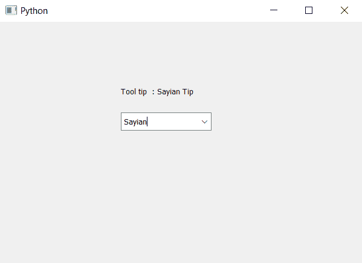

# PyQt5–访问组合框的工具提示

> 原文:[https://www . geesforgeks . org/pyqt 5-访问工具提示组合框/](https://www.geeksforgeeks.org/pyqt5-accessing-tool-tip-of-the-combo-box/)

在本文中我们将看到如何访问组合框的工具提示，工具提示基本上是鼠标悬停在组合框小部件上时出现的提示。为了给组合框设置工具提示，我们使用`setToolTip`方法。

**注意:**工具提示仅在鼠标悬停在组合框上而不是下拉视图上时可见

为了访问工具提示，我们使用`toolTip`方法

> **语法:**组合框. setToolTip()
> 
> **论证:**不需要论证
> 
> **返回:**返回字符串

下面是实现

```py
# importing libraries
from PyQt5.QtWidgets import * 
from PyQt5 import QtCore, QtGui
from PyQt5.QtGui import * 
from PyQt5.QtCore import * 
import sys

class Window(QMainWindow):

    def __init__(self):
        super().__init__()

        # setting title
        self.setWindowTitle("Python ")

        # setting geometry
        self.setGeometry(100, 100, 600, 400)

        # calling method
        self.UiComponents()

        # showing all the widgets
        self.show()

    # method for widgets
    def UiComponents(self):

        # creating a combo box widget
        self.combo_box = QComboBox(self)

        # setting geometry of combo box
        self.combo_box.setGeometry(200, 150, 150, 30)

        # geek list
        geek_list = ["Sayian", "Super Sayian"]

        # making it editable
        self.combo_box.setEditable(True)

        # adding list of items to combo box
        self.combo_box.addItems(geek_list)

        # tool tip
        tip = "Sayian Tip"

        # setting tool tip to the combo box
        self.combo_box.setToolTip(tip)

        # getting the tool tip
        get_tip = self.combo_box.toolTip()

        # creating label to show the tool tip
        label = QLabel("Tool tip  : " + get_tip, self)

        # setting geometry of the label
        label.setGeometry(200, 100, 200, 30)

# create pyqt5 app
App = QApplication(sys.argv)

# create the instance of our Window
window = Window()

# start the app
sys.exit(App.exec())
```

**输出:**
