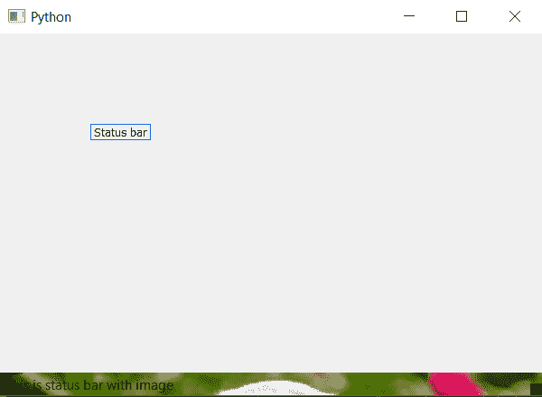

# PyQt5–将背景图像添加到状态栏

> 原文:[https://www . geesforgeks . org/pyqt 5-add-background-image-to-status bar/](https://www.geeksforgeeks.org/pyqt5-add-background-image-to-statusbar/)

在本文中，我们将看到如何设置背景图像的状态栏。我们可以使用`setStyleSheet()`方法中的`background-color`设置背景颜色，也可以使用`setStyleSheet()`方法中的`background-image`将背景图像设置为标签。

> **语法:** self.statusBar()。set 样式表(“背景图像:URL(image . png)；”)
> 
> **自变量:**它以字符串为自变量。
> 
> **执行的操作:**将背景图像设置为状态栏。

**代码:**

```
from PyQt5.QtCore import * 
from PyQt5.QtGui import * 
from PyQt5.QtWidgets import * 
import sys

class Window(QMainWindow):
    def __init__(self):
        super().__init__()

        # set the title
        self.setWindowTitle("Python")

        # setting  the geometry of window
        self.setGeometry(60, 60, 600, 400)

        # setting status bar message
        self.statusBar().showMessage("This is status bar with image")

        # setting background image to status bar
        self.statusBar().setStyleSheet("background-image : url(image.png);")

        # creating a label widget
        self.label_1 = QLabel("Status bar", self)

        # moving position
        self.label_1.move(100, 100)

        # setting up the border
        self.label_1.setStyleSheet("border :1px solid blue;")

        # resizing label
        self.label_1.adjustSize()

        # show all the widgets
        self.show()

# create pyqt5 app
App = QApplication(sys.argv)

# create the instance of our Window
window = Window()

# start the app
sys.exit(App.exec())
```

**输出:**
