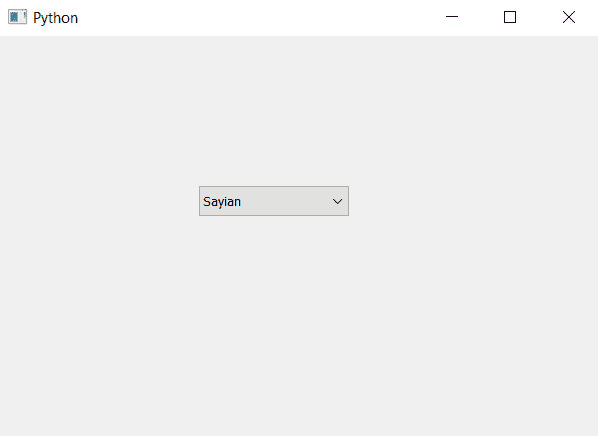

# PyQt5–在状态组合框

上将边框添加到不可编辑状态

> 原文:[https://www . geeksforgeeks . org/pyqt 5-添加-边框到不可编辑-on-state-combobox/](https://www.geeksforgeeks.org/pyqt5-add-border-to-non-editable-on-state-combobox/)

在本文中，我们将看到如何在不可编辑的组合框处于打开状态时为其添加边框。开启状态基本上是当组合框列表视图打开时。此自定义边框仅在组合框处于打开状态且不可编辑时出现。

为了做到这一点，我们必须更改与组合框关联的样式表，下面是样式表代码

```py
QComboBox::!editable:on
{
border : 3px solid blue;
}

```

下面是实现

```py
# importing libraries
from PyQt5.QtWidgets import * 
from PyQt5 import QtCore, QtGui
from PyQt5.QtGui import * 
from PyQt5.QtCore import * 
import sys

class Window(QMainWindow):

    def __init__(self):
        super().__init__()

        # setting title
        self.setWindowTitle("Python ")

        # setting geometry
        self.setGeometry(100, 100, 600, 400)

        # calling method
        self.UiComponents()

        # showing all the widgets
        self.show()

    # method for widgets
    def UiComponents(self):

        # creating a combo box widget
        self.combo_box = QComboBox(self)

        # setting geometry of combo box
        self.combo_box.setGeometry(200, 150, 150, 30)

        # geek list
        geek_list = ["Sayian", "Super Sayian", "Super Sayian 2", "Super Sayian B"]

        # adding list of items to combo box
        self.combo_box.addItems(geek_list)

        # editing style sheet code of combo box
        # adding border to the combo box when it is non-editable
        # and is in ON state
        self.combo_box.setStyleSheet("QComboBox::! editable:on"
                                     "{"
                                     "border : 3px solid red;"
                                     "}")

# create pyqt5 app
App = QApplication(sys.argv)

# create the instance of our Window
window = Window()

# start the app
sys.exit(App.exec())
```

**输出:**


按下组合框
后