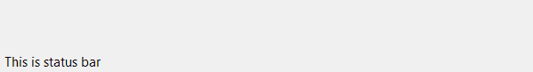
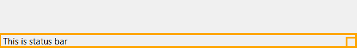
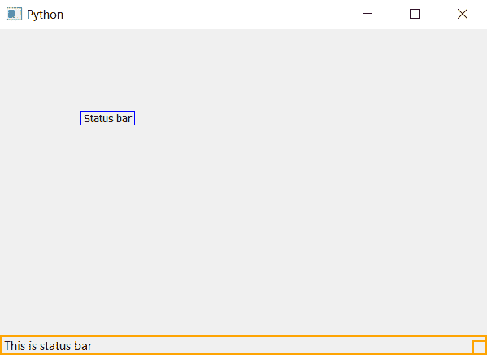

# PyQt5–向状态栏添加边框

> 原文:[https://www . geeksforgeeks . org/pyqt 5-添加-边框到状态栏/](https://www.geeksforgeeks.org/pyqt5-add-border-to-status-bar/)

在本文中，我们将看到如何添加边框到状态栏。默认情况下，状态栏没有边框。下图是不带边框和有边框的状态栏。





为了做到这一点，我们将使用`setStyleSheet()`方法。

> **语法:** self.statusBar()。set 样式表(“边框:3px 纯橙色”)
> 
> **自变量:**它以字符串为自变量。
> 
> **执行的操作:**设置状态栏的边框。

**代码:**

```py
from PyQt5.QtCore import * 
from PyQt5.QtGui import * 
from PyQt5.QtWidgets import * 
import sys

class Window(QMainWindow):
    def __init__(self):
        super().__init__()

        # set the title
        self.setWindowTitle("Python")

        # setting  the geometry of window
        self.setGeometry(60, 60, 600, 400)

        # setting status bar message
        self.statusBar().showMessage("This is status bar")

        # setting border to status bar
        self.statusBar().setStyleSheet("border :3px solid orange")

        # creating a label widget
        self.label_1 = QLabel("Status bar", self)

        # moving position
        self.label_1.move(100, 100)

        # setting up the border
        self.label_1.setStyleSheet("border :1px solid blue;")

        # resizing label
        self.label_1.adjustSize()

        # show all the widgets
        self.show()

# create pyqt5 app
App = QApplication(sys.argv)

# create the instance of our Window
window = Window()

# start the app
sys.exit(App.exec())
```

**输出:**
