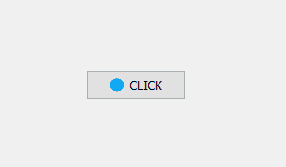

# PyQt5–在按钮上添加图像图标

> 原文:[https://www . geesforgeks . org/pyqt 5-添加图像-按钮图标/](https://www.geeksforgeeks.org/pyqt5-add-image-icon-on-a-push-button/)

在本文中，我们将看到如何向按钮添加图标。这里，设置图标不像设置背景图像，它类似于主窗口的图标。按钮图标出现在左侧，文本大小在右侧。

下图是不带图标和带图标的按钮。
 

为了做到这一点，我们将使用`setIcon`方法。

> **语法:**button . setcon(qicon(' logo . png '))
> 
> **参数:**如果在同一个文件夹，则取文件名，否则取文件路径
> 
> **执行的动作:**将图标设置为按钮。

**代码:**

```
# importing libraries
from PyQt5.QtWidgets import * 
from PyQt5.QtGui import * 
from PyQt5.QtCore import * 
import sys

class Window(QMainWindow):
    def __init__(self):
        super().__init__()

        # setting title
        self.setWindowTitle("Python ")

        # setting geometry
        self.setGeometry(100, 100, 600, 400)

        # calling method
        self.UiComponents()

        # showing all the widgets
        self.show()

    # method for widgets
    def UiComponents(self):

        # creating a push button
        button = QPushButton("CLICK", self)

        # setting geometry of button
        button.setGeometry(200, 150, 100, 30)

        # adding action to a button
        button.clicked.connect(self.clickme)

        # setting icon to the button
        button.setIcon(QIcon('logo.png'))

    # action method
    def clickme(self):

        # printing pressed
        print("pressed")

# create pyqt5 app
App = QApplication(sys.argv)

# create the instance of our Window
window = Window()

# start the app
sys.exit(App.exec())
```

**输出:**
