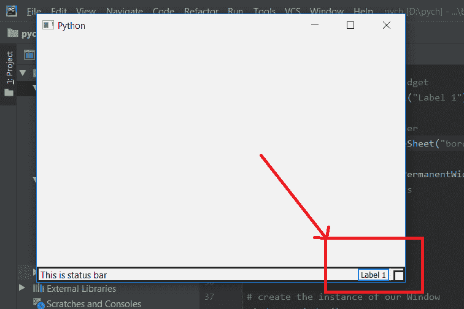

# pyqt 5–向状态栏添加标签

> 原文:[https://www.geeksforgeeks.org/pyqt5-add-label-to-statusbar/](https://www.geeksforgeeks.org/pyqt5-add-label-to-statusbar/)

在本文中，我们将看到如何向状态栏添加标签。我们可以使用`showMessage`方法将文本设置为状态栏。

**标签和状态工具栏？**
一个**标签**是一个在表单上显示文本的图形控制元素。它通常是静态控件；没有交互性。标签通常用于标识附近的文本框或其他小部件。一个**状态栏是**一个横条，通常在屏幕或窗口的底部，显示正在编辑的文档或正在运行的程序的信息。

> **为了做到这一点，我们将执行以下步骤:**
> 
> 1.创建标签
> 2。在标签
> 3 上添加文字。创建状态栏对象
> 4。向状态栏添加标签

**代码:**

```
from PyQt5.QtCore import * 
from PyQt5.QtGui import * 
from PyQt5.QtWidgets import * 
import sys

class Window(QMainWindow):
    def __init__(self):
        super().__init__()

        # set the title
        self.setWindowTitle("Python")

        # setting  the geometry of window
        self.setGeometry(60, 60, 600, 400)

        # setting status bar message
        self.statusBar().showMessage("This is status bar")

        # setting  border and padding with different sizes
        self.statusBar().setStyleSheet("border :3px solid black;")

        # creating a label widget
        self.label_1 = QLabel("Label 1")

        # setting up the border
        self.label_1.setStyleSheet("border :2px solid blue;")

        # adding label to status bar
        self.statusBar().addPermanentWidget(self.label_1)
        # show all the widgets
        self.show()

# create pyqt5 app
App = QApplication(sys.argv)

# create the instance of our Window
window = Window()

# start the app
sys.exit(App.exec())
```

