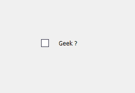
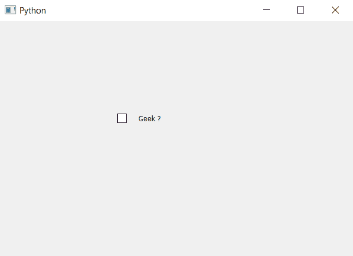

# pyqt 5–增加指示器和复选框

之间的间距

> 原文:[https://www . geeksforgeeks . org/pyqt 5-添加指示器和复选框之间的间距/](https://www.geeksforgeeks.org/pyqt5-add-spacing-between-indicator-and-check-box/)

在本文中，我们将看到如何设置复选框和指示器之间的间距。默认情况下，当我们创建一个复选框时，它们之间会有一些空间，但是我们更改也会更改该空间。下面是默认复选框和增加间距复选框的图示。

 

这可以通过更改复选框样式表中的间距大小来实现，下面是与复选框对象一起使用的样式表代码。

```
QCheckBox
{
spacing : 20px;
}

```

下面是实现。

```
# importing libraries
from PyQt5.QtWidgets import * 
from PyQt5 import QtCore, QtGui
from PyQt5.QtGui import * 
from PyQt5.QtCore import * import sys

class Window(QMainWindow):

    def __init__(self):
        super().__init__()

        # setting title
        self.setWindowTitle("Python ")

        # setting geometry
        self.setGeometry(100, 100, 600, 400)

        # calling method
        self.UiComponents()

        # showing all the widgets
        self.show()

    # method for widgets
    def UiComponents(self):

        # creating the check-box
        checkbox = QCheckBox('Geek ?', self)

        # setting geometry of check box
        checkbox.setGeometry(200, 150, 100, 30)

        # adding spacing in between indicator and check box
        checkbox.setStyleSheet("QCheckBox"
                               "{"
                               "spacing : 20px"
                               "}")

# create pyqt5 app
App = QApplication(sys.argv)

# create the instance of our Window
window = Window()

# start the app
sys.exit(App.exec())
```

**输出:**
