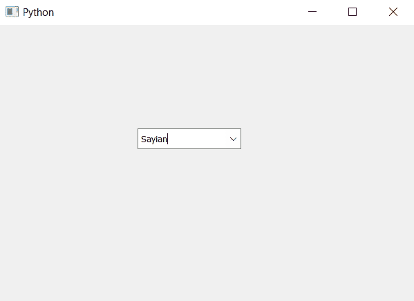

# PyQt5–向组合框添加动作

> 原文:[https://www . geeksforgeeks . org/pyqt 5-向组合框添加动作/](https://www.geeksforgeeks.org/pyqt5-adding-action-to-the-combobox/)

在本文中，我们将看到如何向组合框添加操作。Action 基本上是一个由组合框调用的方法，当它得到更改时，这些更改可以是用户插入的新项，也可以是用户选择的任何项。

为了做到这一点，我们将使用`activated.connect`方法。

> **语法:**组合框.激活.连接(自我.做某事)
> 
> **参数:**取应该被调用的方法名作为参数
> 
> **返回:**无

下面是实现

```py
# importing libraries
from PyQt5.QtWidgets import * 
from PyQt5 import QtCore, QtGui
from PyQt5.QtGui import * 
from PyQt5.QtCore import * 
import sys

class Window(QMainWindow):

    def __init__(self):
        super().__init__()

        # setting title
        self.setWindowTitle("Python ")

        # setting geometry
        self.setGeometry(100, 100, 600, 400)

        # calling method
        self.UiComponents()

        # showing all the widgets
        self.show()

    # method for widgets
    def UiComponents(self):

        # creating a combo box widget
        self.combo_box = QComboBox(self)

        # setting geometry of combo box
        self.combo_box.setGeometry(200, 150, 150, 30)

        # geek list
        geek_list = ["Sayian", "Super Sayian"]

        # making it editable
        self.combo_box.setEditable(True)

        # adding list of items to combo box
        self.combo_box.addItems(geek_list)

        # adding action to combo box
        self.combo_box.activated.connect(self.do_something)

    # method called by combo box
    def do_something(self):

        # printing something
        print("Something Something")

# create pyqt5 app
App = QApplication(sys.argv)

# create the instance of our Window
window = Window()

# start the app
sys.exit(App.exec())
```

**输出:**


当我们选择任何项目时，就会打印出来

```py
Something Something
Something Something

```