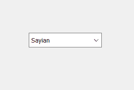
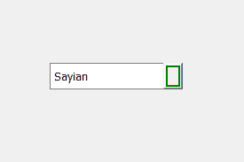
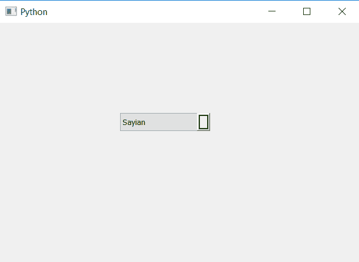

# PyQt5–为组合框的下拉箭头添加边框

> 原文:[https://www . geesforgeks . org/pyqt 5-添加边框到下拉箭头组合框/](https://www.geeksforgeeks.org/pyqt5-adding-border-to-drop-arrow-of-combo-box/)

在本文中，我们将看到如何在组合框的下拉箭头上添加边框。下拉箭头基本上是一个按钮，按下时会打开列表视图。下面是普通组合框和下拉箭头有边框的组合框的图示。

 

为了做到这一点，我们必须改变与组合框相关的样式表，下面是样式表代码

```py
QComboBox::drop-arrow
{
border : 2px solid green;
}
```

下面是实现

## 蟒蛇 3

```py
# importing libraries
from PyQt5.QtWidgets import *
from PyQt5 import QtCore, QtGui
from PyQt5.QtGui import *
from PyQt5.QtCore import *
import sys

class Window(QMainWindow):

    def __init__(self):
        super().__init__()

        # setting title
        self.setWindowTitle("Python ")

        # setting geometry
        self.setGeometry(100, 100, 600, 400)

        # calling method
        self.UiComponents()

        # showing all the widgets
        self.show()

    # method for widgets
    def UiComponents(self):

        # creating a combo box widget
        self.combo_box = QComboBox(self)

        # setting geometry of combo box
        self.combo_box.setGeometry(200, 150, 150, 30)

        # geek list
        geek_list = ["Sayian", "Super Sayian", "Super Sayian 2", "Super Sayian B"]

        # adding list of items to combo box
        self.combo_box.addItems(geek_list)

        # setting style sheet code of combo box
        # adding border to the drop arrow
        self.combo_box.setStyleSheet("QComboBox::down-arrow"
                                     "{"
                                     "border : 2px solid green;"
                                     "}")

# create pyqt5 app
App = QApplication(sys.argv)

# create the instance of our Window
window = Window()

# start the app
sys.exit(App.exec())
```

**输出:**

