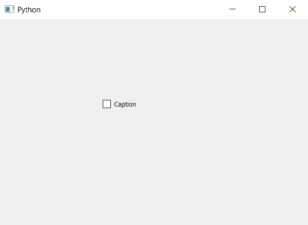

# PyQt5–添加/更改复选框标题

> 原文:[https://www . geesforgeks . org/pyqt 5-添加-更改-复选框标题/](https://www.geeksforgeeks.org/pyqt5-adding-changing-caption-of-check-box/)

在本文中，我们将看到如何添加或更改与复选框关联的标题。在复选框中，基本上有两个部分，一个是由选中符号组成的选中部分，另一个是与包含文本的标签相似的文本部分。

为了添加或更改复选框的文本，我们将使用`setText`方法。

> **语法:**复选框.设置文本(标题)
> 
> **自变量:**它以字符串为自变量。
> 
> **执行的操作:**它将用新标题替换现有标题

下面是实现。

```
# importing libraries
from PyQt5.QtWidgets import * 
from PyQt5 import QtCore, QtGui
from PyQt5.QtGui import * 
from PyQt5.QtCore import * 
import sys

class Window(QMainWindow):

    def __init__(self):
        super().__init__()

        # setting title
        self.setWindowTitle("Python ")

        # setting geometry
        self.setGeometry(100, 100, 600, 400)

        # calling method
        self.UiComponents()

        # showing all the widgets
        self.show()

    # method for widgets
    def UiComponents(self):

        # creating the check-box
        checkbox = QCheckBox('Check Box', self)

        # setting geometry of check box
        checkbox.setGeometry(200, 150, 100, 30)

        # setting check box state to checked
        checkbox.setText("Caption")

# create pyqt5 app
App = QApplication(sys.argv)

# create the instance of our Window
window = Window()

# start the app
sys.exit(App.exec())
```

**输出:**
