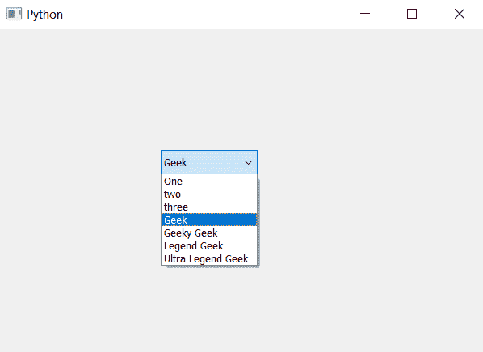

# pyqt 5–在组合框

中的给定索引处添加多个项目

> 原文:[https://www . geeksforgeeks . org/pyqt 5-在给定索引中添加多个项目-组合框/](https://www.geeksforgeeks.org/pyqt5-adding-multiple-items-at-given-index-in-combobox/)

在本文中，我们将看到如何在给定索引的组合框中添加多个项目。我们知道我们可以借助`addItem`和`addItems`方法添加项目，但是项目只在最后添加，为了在给定的索引处添加多个项目，我们使用`insertItems`方法。

> **语法:**组合框。插入项目(索引，项目列表)
> 
> **参数:**需要两个参数一个是整数即索引，第二个是列表即每个元素都是 tsring 的列表
> 
> **执行的操作:**它将在给定的索引处添加项目

以下是实施–

```py
# importing libraries
from PyQt5.QtWidgets import * 
from PyQt5 import QtCore, QtGui
from PyQt5.QtGui import * 
from PyQt5.QtCore import * 
import sys

class Window(QMainWindow):

    def __init__(self):
        super().__init__()

        # setting title
        self.setWindowTitle("Python ")

        # setting geometry
        self.setGeometry(100, 100, 600, 400)

        # calling method
        self.UiComponents()

        # showing all the widgets
        self.show()

    # method for widgets
    def UiComponents(self):

        # creating a combo box widget
        self.combo_box = QComboBox(self)

        # setting geometry of combo box
        self.combo_box.setGeometry(200, 150, 120, 30)

        # geek list
        geek_list = ["Geek", "Geeky Geek", "Legend Geek", "Ultra Legend Geek"]

        # adding list of items to combo box
        self.combo_box.addItems(geek_list)

        # new item list
        new = ["One", "two", "three"]

        # adding item list at index 0
        self.combo_box.insertItems(0, new)

# create pyqt5 app
App = QApplication(sys.argv)

# create the instance of our Window
window = Window()

# start the app
sys.exit(App.exec())
```

**输出:**
