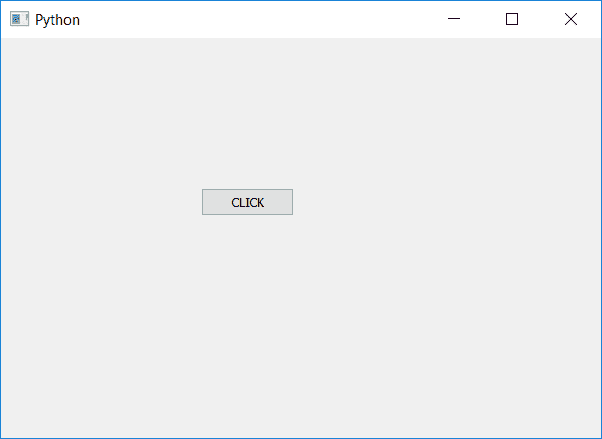

# PyQt5–根据文字

调整按钮大小

> 原文:[https://www . geesforgeks . org/pyqt 5-根据文本调整按钮大小/](https://www.geeksforgeeks.org/pyqt5-adjust-the-size-of-push-button-according-to-the-text/)

在本文中，我们将看到如何根据文本调整按钮的大小。我们知道，每次手动调整按钮大小时，我们都可以使用`resize`方法来改变按钮的大小，这很困难。所以我们有`adjustSize`方法，根据里面的文字自动调整按钮的大小。

> **语法:**按钮.调整大小()
> 
> **论证:**不需要论证。
> 
> **执行的动作:**根据里面的文字改变按钮的大小。

**代码:**

```py
# importing libraries
from PyQt5.QtWidgets import * 
from PyQt5.QtGui import * 
from PyQt5.QtCore import * 
import sys

class Window(QMainWindow):
    def __init__(self):
        super().__init__()

        # setting title
        self.setWindowTitle("Python ")

        # setting geometry
        self.setGeometry(100, 100, 600, 400)

        # calling method
        self.UiComponents()

        # showing all the widgets
        self.show()

    # method for widgets
    def UiComponents(self):

        # creating a push button
        button = QPushButton("CLICK", self)

        # setting geometry of button
        button.setGeometry(200, 150, 200, 40)

        # adjusting the size of button
        button.adjustSize()

        # adding action to a button
        button.clicked.connect(self.clickme)

    # action method
    def clickme(self):

        # printing pressed
        print("pressed")

# create pyqt5 app
App = QApplication(sys.argv)

# create the instance of our Window
window = Window()

# start the app
sys.exit(App.exec())
```

**输出:**
