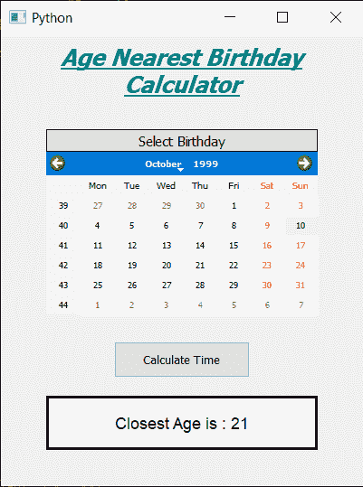

# PyQt5–年龄最近生日计算器

> 原文:[https://www . geeksforgeeks . org/pyqt 5-年龄-最近生日-计算器/](https://www.geeksforgeeks.org/pyqt5-age-nearest-birthday-calculator/)

在这篇文章中，我们将看到如何创建一个年龄最近的生日计算器。年龄最近计算器是用来计算最接近出生日期的年龄的计算器。下面是年龄最近的计算器的样子



**概念:**我们可以通过获得出生日期和现在日期之间的差异来获得最接近生日的年龄，借助 python datetime 对象将记录闰年，我们可以获得日期之间的天数。然后这些日子可以用 365.32422 除得到年份，那么年份的取整值将是最接近生日的年龄

> **GUI 实现步骤:**
> 1。创建显示计算器名称
> 2 的标题标签。创建标签显示用户选择出生日期
> 3。创建一个 QCalendarWidget 对象供用户选择出生日期
> 4。创建一个按钮来计算最近的年龄
> 5。创建一个标签来显示计算出的年龄
> 
> **后端实现:**
> 1。制作日历未来日期块，即将当前日期设为最大日期
> 2。给按钮增加动作
> 3。在按钮动作内获取日历中的日期和当前日期
> 4。从两个日期中获取日、月和年
> 5。为两个日期创建一个 datetime.date 对象
> 6。从两个日期中找出差异，得到天数
> 7。用 365.2422(由于闰年)除以天数，得到总年数
> 8。获取年份的舍入值，并通过标签显示该值

下面是实现

```
# importing libraries
from PyQt5.QtWidgets import * 
from PyQt5 import QtCore, QtGui
from PyQt5.QtGui import * 
from PyQt5.QtCore import * 
import datetime
import sys

class Window(QMainWindow):

    def __init__(self):
        super().__init__()

        # setting title
        self.setWindowTitle("Python ")

        # width of window
        self.w_width = 400

        # height of window
        self.w_height = 500

        # setting geometry
        self.setGeometry(100, 100, self.w_width, self.w_height)

        # calling method
        self.UiComponents()

        # showing all the widgets
        self.show()

    # method for components
    def UiComponents(self):

        # creating head label
        head = QLabel("Age Nearest Birthday Calculator", self)

        head.setWordWrap(True)

        # setting geometry to the head
        head.setGeometry(0, 10, 400, 60)

        # font
        font = QFont('Times', 15)
        font.setBold(True)
        font.setItalic(True)
        font.setUnderline(True)

        # setting font to the head
        head.setFont(font)

        # setting alignment of the head
        head.setAlignment(Qt.AlignCenter)

        # setting color effect to the head
        color = QGraphicsColorizeEffect(self)
        color.setColor(Qt.darkCyan)
        head.setGraphicsEffect(color)

        # creating a label
        b_label = QLabel("Select Birthday", self)

        # setting properties  label
        b_label.setAlignment(Qt.AlignCenter)
        b_label.setGeometry(50, 105, 300, 25)
        b_label.setStyleSheet("QLabel"
                              "{"
                              "border : 1px solid black;"
                              "background : rgba(70, 70, 70, 25);"
                              "}")
        b_label.setFont(QFont('Times', 9))

        # creating a calendar widget to select the date
        self.calendar = QCalendarWidget(self)

        # setting geometry of the calendar
        self.calendar.setGeometry(50, 130, 300, 180)

        # setting font to the calendar
        self.calendar.setFont(QFont('Times', 6))

        # getting current date
        date = QDate.currentDate()

        # blocking future dates
        self.calendar.setMaximumDate(date)

        # creating a push button
        calculate = QPushButton("Calculate Time", self)

        # setting geometry to the push button
        calculate.setGeometry(125, 340, 150, 40)

        # adding action to the calculate button
        calculate.clicked.connect(self.calculate_action)

        # creating a label to show percentile
        self.result = QLabel(self)

        # setting properties to result label
        self.result.setAlignment(Qt.AlignCenter)
        self.result.setGeometry(50, 400, 300, 60)
        self.result.setWordWrap(True)
        self.result.setStyleSheet("QLabel"
                                  "{"
                                  "border : 3px solid black;"
                                  "background : white;"
                                  "}")
        self.result.setFont(QFont('Arial', 11))

    def calculate_action(self):

        # getting birth date day
        birth = self.calendar.selectedDate()

        # getting year and month day of birth day
        birth_year = birth.year()
        birth_month = birth.month()
        birth_day = birth.day()

        # getting today date
        current = QDate.currentDate()

        # getting year and month day of current day
        current_year = current.year()
        current_month = current.month()
        current_day = current.day()

        # coverting  dates into date object
        birth_date = datetime.date(birth_year, birth_month, birth_day)
        current_date = datetime.date(current_year, current_month, current_day)

        # getting difference in both the dates
        difference = current_date - birth_date

        # getting days from the difference
        difference = difference.days

        # getting years from the difference
        years = difference / 365.2422

        # getting round value of years
        years = round(years)

        # setting this value with the help of label
        self.result.setText("Closest Age is : " + str(years))

# create pyqt5 app
App = QApplication(sys.argv)

# create the instance of our Window
window = Window()

# start the app
sys.exit(App.exec())
```

**输出:**

<video class="wp-video-shortcode" id="video-434886-1" width="640" height="800" preload="metadata" controls=""><source type="video/mp4" src="https://media.geeksforgeeks.org/wp-content/uploads/20200615030913/Python-2020-06-15-03-08-44.mp4?_=1">[https://media.geeksforgeeks.org/wp-content/uploads/20200615030913/Python-2020-06-15-03-08-44.mp4](https://media.geeksforgeeks.org/wp-content/uploads/20200615030913/Python-2020-06-15-03-08-44.mp4)</video>