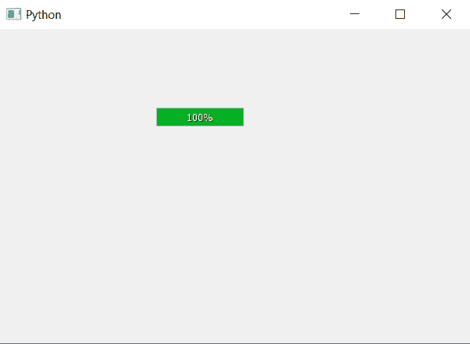

# PyQt5–自动调整进度条大小

> 原文:[https://www . geesforgeks . org/pyqt 5-自动调整-进度条-大小/](https://www.geeksforgeeks.org/pyqt5-auto-adjusting-progress-bar-size/)

在本文中，我们将看到如何调整进度条的大小。调整大小意味着根据需要设置进度条的大小，不要太大也不要太小，只要能包含进度条中所有文本的大小即可。为了做到这一点，我们将使用`adjustSize`方法。

**注意:**调整尺寸将设置所需的最小尺寸。不依赖于使用`setFormat`方法添加的文本。

> **语法:**bar . adjustize()
> 
> **论证:**不需要论证。
> 
> **执行的动作:**会根据需要调整大小。

下面是实现。

```
# importing libraries
from PyQt5.QtWidgets import * 
from PyQt5 import QtCore, QtGui
from PyQt5.QtGui import * 
from PyQt5.QtCore import * 
import sys

class Window(QMainWindow):

    def __init__(self):
        super().__init__()

        # setting title
        self.setWindowTitle("Python ")

        # setting geometry
        self.setGeometry(100, 100, 600, 400)

        # calling method
        self.UiComponents()

        # showing all the widgets
        self.show()

    # method for widgets
    def UiComponents(self):
        # creating progress bar
        bar = QProgressBar(self)

        # setting geometry to progress bar
        bar.setGeometry(200, 100, 20, 50)

        # setting the value
        bar.setValue(100)

        # setting alignment to center
        bar.setAlignment(Qt.AlignCenter)

        # adjusting the size of the progress bar
        bar.adjustSize()

App = QApplication(sys.argv)

# create the instance of our Window
window = Window()

# start the app
sys.exit(App.exec())
```

**输出:**
