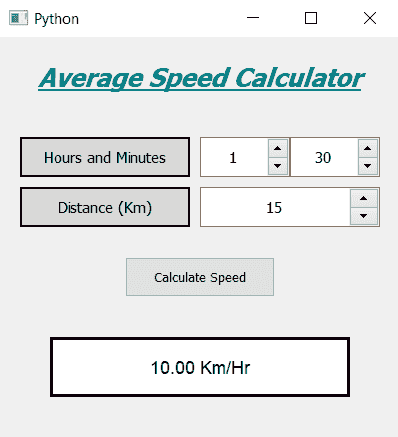

# PyQt5–平均速度计算器

> 原文:[https://www . geesforgeks . org/pyqt 5-平均速度-计算器/](https://www.geeksforgeeks.org/pyqt5-average-speed-calculator/)

在本文中，我们将看到如何使用 PyQt5 创建一个平均速度计算器。物体的平均速度是物体行驶的总距离除以行驶的时间，下面是平均速度计算器的样子



**概念:**我们会以小时和分钟的形式得到时间，以公里的形式得到距离，当用户按下计算按钮时，我们会首先检查是否给出了无效的输入，如果输入是正确的，那么我们会将小时和分钟转换成小时并计算速度，并将速度显示在屏幕上。

> **GUI 实现步骤:**
> 1。创建显示计算器名称
> 2 的标题标签。创建标签向用户显示设置的小时和分钟
> 3。创建两个 QSpinBox 对象以获得小时和分钟
> 4。创建另一个标签来显示用户设置的距离，并对应于该标签创建一个 QSpinBox 来获得距离
> 5。创建一个按钮来计算平均速度
> 6。创建一个标签来显示计算出的速度
> 
> **后端实现:**
> 1。将分钟旋转框的最大值设置为 60，并增加距离旋转框
> 2 的最大值。给按钮增加动作
> 3。在按钮操作中，获取小时、分钟和离旋转框的距离
> 4。检查距离或时间值是否为零，然后返回该功能，以便动作停止进一步执行
> 5。将小时和分钟转换为小时，并使用该时间计算速度
> 6。借助标签在屏幕上显示速度

下面是实现

```
# importing libraries
from PyQt5.QtWidgets import * 
from PyQt5 import QtCore, QtGui
from PyQt5.QtGui import * 
from PyQt5.QtCore import * 
import sys

class Window(QMainWindow):

    def __init__(self):
        super().__init__()

        # setting title
        self.setWindowTitle("Python ")

        # width of window
        self.w_width = 400

        # height of window
        self.w_height = 400

        # setting geometry
        self.setGeometry(100, 100, self.w_width, self.w_height)

        # calling method
        self.UiComponents()

        # showing all the widgets
        self.show()

    # method for components
    def UiComponents(self):

        # creating head label
        head = QLabel("Average Speed Calculator", self)

        # setting geometry to the head
        head.setGeometry(0, 10, 400, 60)

        # font
        font = QFont('Times', 15)
        font.setBold(True)
        font.setItalic(True)
        font.setUnderline(True)

        # setting font to the head
        head.setFont(font)

        # setting alignment of the head
        head.setAlignment(Qt.AlignCenter)

        # setting color effect to the head
        color = QGraphicsColorizeEffect(self)
        color.setColor(Qt.darkCyan)
        head.setGraphicsEffect(color)

        # creating a label
        t_label = QLabel("Hours and Minutes", self)

        # setting properties to the  label
        t_label.setAlignment(Qt.AlignCenter)
        t_label.setGeometry(20, 100, 170, 40)
        t_label.setStyleSheet("QLabel"
                              "{"
                              "border : 2px solid black;"
                              "background : rgba(70, 70, 70, 35);"
                              "}")
        t_label.setFont(QFont('Times', 9))

        # creating a spin box to get the hours
        self.hours = QSpinBox(self)

        # setting geometry to the spin box
        self.hours.setGeometry(200, 100, 90, 40)

        # setting font and alignment
        self.hours.setFont(QFont('Times', 9))
        self.hours.setAlignment(Qt.AlignCenter)

        # creating a spin box to get the minutes
        self.minutes = QSpinBox(self)

        # setting geometry to the spin box
        self.minutes.setGeometry(290, 100, 90, 40)

        # setting maximum value of minutes spin box
        self.minutes.setMaximum(60)

        # setting font and alignment
        self.minutes.setFont(QFont('Times', 9))
        self.minutes.setAlignment(Qt.AlignCenter)

        # creating a label
        d_label = QLabel("Distance (Km)", self)

        # setting properties to the label
        d_label.setAlignment(Qt.AlignCenter)
        d_label.setGeometry(20, 150, 170, 40)
        d_label.setStyleSheet("QLabel"
                              "{"
                              "border : 2px solid black;"
                              "background : rgba(70, 70, 70, 35);"
                              "}")
        d_label.setFont(QFont('Times', 9))

        # creating a spin box to get the distance
        self.distance = QSpinBox(self)

        # setting geometry to the spin box
        self.distance.setGeometry(200, 150, 180, 40)

        # setting maximum value of minutes spin box
        self.distance.setMaximum(99999999)

        # setting font and alignment
        self.distance.setFont(QFont('Times', 9))
        self.distance.setAlignment(Qt.AlignCenter)

        # creating a push button
        calculate = QPushButton("Calculate Speed", self)

        # setting geometry to the push button
        calculate.setGeometry(125, 220, 150, 40)

        # adding action to the calculate button
        calculate.clicked.connect(self.calculate_action)

        # creating a label to show percentile
        self.result = QLabel(self)

        # setting properties to result label
        self.result.setAlignment(Qt.AlignCenter)
        self.result.setGeometry(50, 300, 300, 60)
        self.result.setStyleSheet("QLabel"
                                  "{"
                                  "border : 3px solid black;"
                                  "background : white;"
                                  "}")
        self.result.setFont(QFont('Arial', 11))

    def calculate_action(self):

        # getting hours
        hours = self.hours.value()

        # getting minutes
        minutes = self.minutes.value()

        # getting distance
        distance = self.distance.value()

        # checking if time value is zero or distance is zero
        # return the function i.e do nothing
        if distance == 0:
            return
        elif hours == 0 and minutes == 0:
            return

        # converting minutes into hours
        # and adding it to hours i.e total time
        time = hours + minutes / 60

        # calculate the speed
        speed = distance / time

        # setting formatting of the speed
        speed = '%.2f' % speed

        # setting text tot he label
        self.result.setText(str(speed) + " Km / Hr")

# create pyqt5 app
App = QApplication(sys.argv)

# create the instance of our Window
window = Window()

# start the app
sys.exit(App.exec())
```

**输出:**

<video class="wp-video-shortcode" id="video-434888-1" width="640" height="640" preload="metadata" controls=""><source type="video/mp4" src="https://media.geeksforgeeks.org/wp-content/uploads/20200615225404/Python-2020-06-15-22-53-26.mp4?_=1">[https://media.geeksforgeeks.org/wp-content/uploads/20200615225404/Python-2020-06-15-22-53-26.mp4](https://media.geeksforgeeks.org/wp-content/uploads/20200615225404/Python-2020-06-15-22-53-26.mp4)</video>