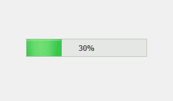
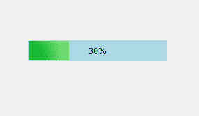
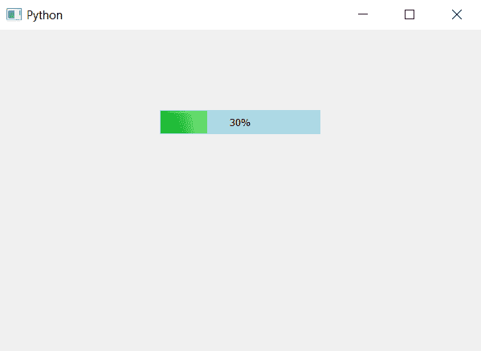

# PyQt5–进度条背景色

> 原文:[https://www . geesforgeks . org/pyqt 5-进度条背景色/](https://www.geeksforgeeks.org/pyqt5-background-color-of-progress-bar/)

当我们创建一个进度条时，默认情况下没有设置背景色，尽管进度条颜色是绿色的。在本文中，我们将看到如何设置进度条的背景颜色。下面是普通进度条和带有背景色的进度条的图示。

 

为了做到这一点，我们必须使用`setStyleSheet`方法改变 CSS 样式表，下面是样式表。

```
QProgressBar
{
background-color :lightblue;
border : 1px;
}

```

下面是实现。

```
# importing libraries
from PyQt5.QtWidgets import * 
from PyQt5 import QtCore, QtGui
from PyQt5.QtGui import * 
from PyQt5.QtCore import * 
import sys

class Window(QMainWindow):

    def __init__(self):
        super().__init__()

        # setting title
        self.setWindowTitle("Python ")

        # setting geometry
        self.setGeometry(100, 100, 600, 400)

        # calling method
        self.UiComponents()

        # showing all the widgets
        self.show()

    # method for widgets
    def UiComponents(self):
        # creating progress bar
        bar = QProgressBar(self)

        # setting geometry to progress bar
        bar.setGeometry(200, 100, 200, 30)

        # setting the value
        bar.setValue(30)

        # setting alignment to center
        bar.setAlignment(Qt.AlignCenter)

        # setting background color
        bar.setStyleSheet("QProgressBar"
                          "{"
                          "background-color : lightblue;"
                          "border : 1px"
                          "}")

App = QApplication(sys.argv)

# create the instance of our Window
window = Window()

# start the app
sys.exit(App.exec())
```

**输出:**
