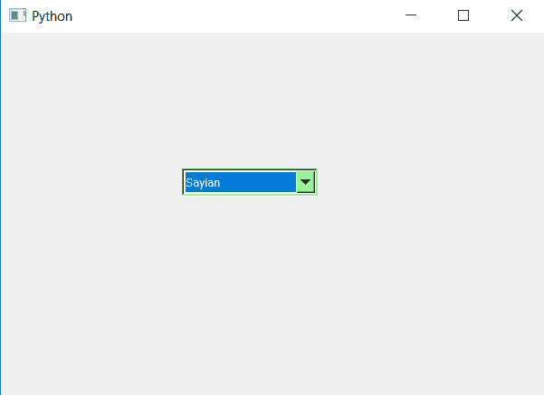

# PyQt5–组合框的背景颜色，如果它不可编辑

> 原文:[https://www . geesforgeks . org/pyqt 5-背景色到组合框-如果不可编辑/](https://www.geeksforgeeks.org/pyqt5-background-color-to-combobox-if-it-is-non-editable/)

在本文中，我们将看到当组合框处于不可编辑状态时，如何设置它的背景色。默认情况下，组合框是灰色的，尽管我们可以更改它的颜色。此背景色仅在组合框小部件处于不可编辑状态时出现。

如果组合框处于可编辑状态，可以有两种方式设置背景色:一种是每次检查是否可编辑；如果不可编辑，则设置背景色，否则删除背景色，另一个简单的方法是借助样式表。

为此，我们必须更改组合框的样式表代码，下面是样式表代码–

```py
QComboBox::!editable
{
background-color : lightgreen;
}

```

下面是实现

```py
# importing libraries
from PyQt5.QtWidgets import * 
from PyQt5 import QtCore, QtGui
from PyQt5.QtGui import * 
from PyQt5.QtCore import * 
import sys

class Window(QMainWindow):

    def __init__(self):
        super().__init__()

        # setting title
        self.setWindowTitle("Python ")

        # setting geometry
        self.setGeometry(100, 100, 600, 400)

        # calling method
        self.UiComponents()

        # showing all the widgets
        self.show()

    # method for widgets
    def UiComponents(self):

        # creating a combo box widget
        self.combo_box = QComboBox(self)

        # setting geometry of combo box
        self.combo_box.setGeometry(200, 150, 150, 30)

        # geek list
        geek_list = ["Sayian", "Super Sayian", "Super Sayian 2", "Super Sayian B"]

        # adding list of items to combo box
        self.combo_box.addItems(geek_list)

        # adding background color to the combo box when it is in editable state
        self.combo_box.setStyleSheet("QComboBox::! editable"
                                     "{"
                                     "background-color: lightgreen;"
                                     "}")

# create pyqt5 app
App = QApplication(sys.argv)

# create the instance of our Window
window = Window()

# start the app
sys.exit(App.exec())
```

**输出:**
