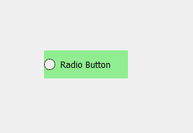
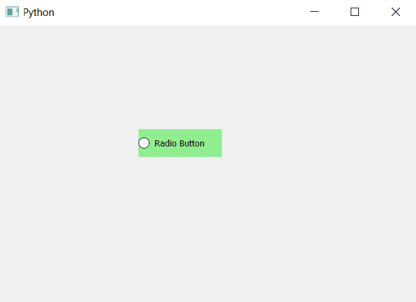

# pyqt 5–单选按钮的背景颜色

> 原文:[https://www . geesforgeks . org/pyqt 5-背景色转单选按钮/](https://www.geeksforgeeks.org/pyqt5-background-color-to-radio-button/)

在本文中，我们将看到如何设置单选按钮的背景颜色(文本部分)。默认情况下，没有背景颜色与单选按钮相关联，尽管我们可以为其设置背景颜色。

下面是普通单选按钮与带有背景色的单选按钮的图示。
 

为了给单选按钮添加背景色，我们必须执行以下操作:更改与之关联的样式表代码，并为其添加背景色。下面是样式表代码。

```py
QRadioButton
{
background-color : lightgreen;
}

```

下面是实现。

```py
# importing libraries
from PyQt5.QtWidgets import * 
from PyQt5 import QtCore, QtGui
from PyQt5.QtGui import * 
from PyQt5.QtCore import * 
import sys

class Window(QMainWindow):

    def __init__(self):
        super().__init__()

        # setting title
        self.setWindowTitle("Python ")

        # setting geometry
        self.setGeometry(100, 100, 600, 400)

        # calling method
        self.UiComponents()

        # showing all the widgets
        self.show()

    # method for widgets
    def UiComponents(self):

        # creating a radio button
        radio_button = QRadioButton(self)

        # setting geometry of radio button
        radio_button.setGeometry(200, 150, 120, 40)

        # setting text to radio button
        radio_button.setText("Radio Button")

        # setting style sheet associated with the radio button
        # adding color to the radio button
        radio_button.setStyleSheet("QRadioButton"
                                   "{"
                                   "background-color : lightgreen"
                                   "}")

# create pyqt5 app
App = QApplication(sys.argv)

# create the instance of our Window
window = Window()

# start the app
sys.exit(App.exec())
```

**输出:**
