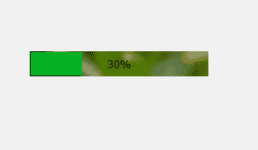
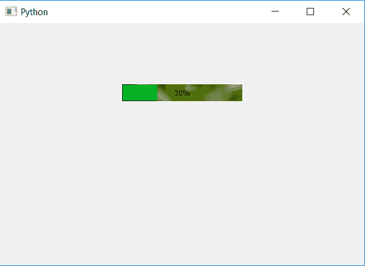

# PyQt5–进度条中的背景图像

> 原文:[https://www . geesforgeks . org/pyqt 5-背景-进行中图像-进度条/](https://www.geeksforgeeks.org/pyqt5-background-image-in-progress-bar/)

在本文中，我们将看到如何设置进度条的背景图像。默认情况下，进度条上没有设置背景图像，下面是普通进度条与带有背景图像的进度条的对比。

 

为了做到这一点，我们必须使用 CSS 样式表，下面是样式表的代码。

```
QProgressBar
{
 background-image : url(image.png);
 border : 1px solid white;
}

```

这个样式表是和`setStyleSheet`方法一起使用的，下面是代码的实现。

```
# importing libraries
from PyQt5.QtWidgets import * 
from PyQt5 import QtCore, QtGui
from PyQt5.QtGui import * 
from PyQt5.QtCore import * 
import sys

class Window(QMainWindow):

    def __init__(self):
        super().__init__()

        # setting title
        self.setWindowTitle("Python ")

        # setting geometry
        self.setGeometry(100, 100, 600, 400)

        # calling method
        self.UiComponents()

        # showing all the widgets
        self.show()

    # method for widgets
    def UiComponents(self):
        # creating progress bar
        bar = QProgressBar(self)

        # setting geometry to progress bar
        bar.setGeometry(200, 100, 200, 30)

        # setting the value
        bar.setValue(30)

        # setting alignment to center
        bar.setAlignment(Qt.AlignCenter)

        # setting background
        bar.setStyleSheet(
                          "QProgressBar"
                          "{"
                          "background-image: url(image.png);"
                          " border: 1px solid white;"
                          "} "
                          )

App = QApplication(sys.argv)

# create the instance of our Window
window = Window()

# start the app
sys.exit(App.exec())
```

**输出:**
