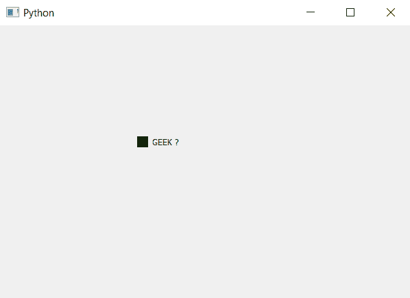

# pyqt 5–单选按钮指示器的背景图像

> 原文:[https://www . geeksforgeeks . org/pyqt 5-背景图像到指示器单选按钮/](https://www.geeksforgeeks.org/pyqt5-background-image-to-indicator-of-radio-button/)

在本文中，我们将了解如何将背景图像设置为单选按钮的指示器。单选按钮有两个部分，一个是文本部分，即标签部分，另一个是指示器，默认情况下，指示器是圆形的，没有图像与之相关联。

为了给单选按钮的指示器添加背景图像，我们必须更改与之关联的样式表代码，下面是样式表代码。

```
QRadioButton::indicator
{
backgrpund-image : url(image.png)
}

```

**注意:**当我们给指示器添加背景图像时，它的形状会从圆形变为方形。

下面是实现。

```
# importing libraries
from PyQt5.QtWidgets import * 
from PyQt5 import QtCore, QtGui
from PyQt5.QtGui import * 
from PyQt5.QtCore import * 
import sys

class Window(QMainWindow):

    def __init__(self):
        super().__init__()

        # setting title
        self.setWindowTitle("Python ")

        # setting geometry
        self.setGeometry(100, 100, 600, 400)

        # calling method
        self.UiComponents()

        # showing all the widgets
        self.show()

    # method for widgets
    def UiComponents(self):

        # creating a radio button
        radio_button = QRadioButton(self)

        # setting geometry of radio button
        radio_button.setGeometry(200, 150, 120, 40)

        # setting text to radio button
        radio_button.setText("GEEK ?")

        # setting the style sheet
        # adding background image to the indicator of radio button
        radio_button.setStyleSheet("QRadioButton::indicator"
                                   "{"
                                   "background-image : url(image.png);"
                                   "}")

# create pyqt5 app
App = QApplication(sys.argv)

# create the instance of our Window
window = Window()

# start the app
sys.exit(App.exec())
```

**输出:**
