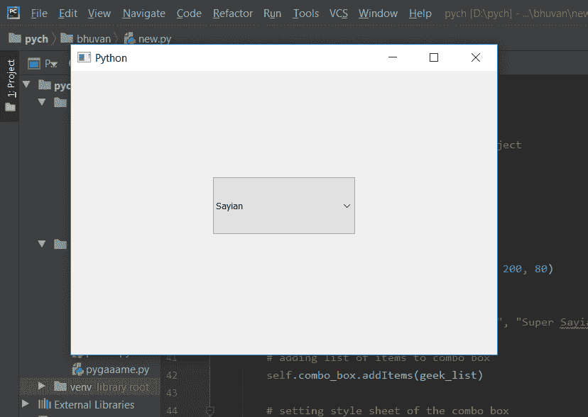
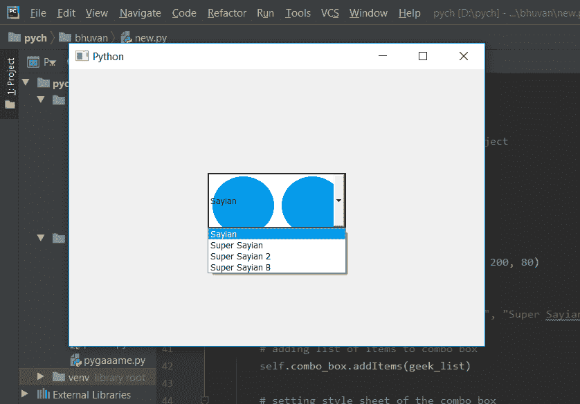

# pyqt 5–开启状态时背景图像变为不可编辑的组合框

> 原文:[https://www . geesforgeks . org/pyqt 5-背景-图像到不可编辑-combobox-开启状态时/](https://www.geeksforgeeks.org/pyqt5-background-image-to-non-editable-combobox-when-on-state/)

在本文中，我们将看到当组合框不可编辑并且处于打开状态时，我们如何设置它的背景图像。默认情况下，组合框没有图像，尽管我们可以设置图像。只有当组合框处于不可编辑状态且处于打开状态时，背景图像才会出现。打开状态是列表视图打开时的状态。普通的组合框可以通过`setEditable`方法进行编辑。

为了做到这一点，我们必须更改与组合框关联的样式表，下面是样式表代码–

```py
QComboBox::!editable:on
{
background-image : url(image.png);
border : 2px solid black;
}

```

下面是实现

```py
# importing libraries
from PyQt5.QtWidgets import * 
from PyQt5 import QtCore, QtGui
from PyQt5.QtGui import * 
from PyQt5.QtCore import * 
import sys

class Window(QMainWindow):

    def __init__(self):
        super().__init__()

        # setting title
        self.setWindowTitle("Python ")

        # setting geometry
        self.setGeometry(100, 100, 600, 400)

        # calling method
        self.UiComponents()

        # showing all the widgets
        self.show()

    # method for widgets
    def UiComponents(self):
        # creating a check-able combo box object
        self.combo_box = QComboBox(self)

        # making combo box editable
        # self.combo_box.setEditable(True)

        # setting geometry of combo box
        self.combo_box.setGeometry(200, 150, 200, 80)

        # geek list
        geek_list = ["Sayian", "Super Sayian", "Super Sayian 2", "Super Sayian B"]

        # adding list of items to combo box
        self.combo_box.addItems(geek_list)

        # setting style sheet of the combo box
        # adding background image to the combo box it is in non-editable state
        # and when combo box is in on state
        self.combo_box.setStyleSheet("QComboBox::! editable:on"
                                     "{"
                                     "background-image : url(logo.png);"
                                     "border : 2px solid black;"
                                     "}")

# create pyqt5 app
App = QApplication(sys.argv)

# create the instance of our Window
window = Window()

window.show()

# start the app
sys.exit(App.exec())
```

**输出:**

进入 on 状态
