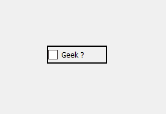
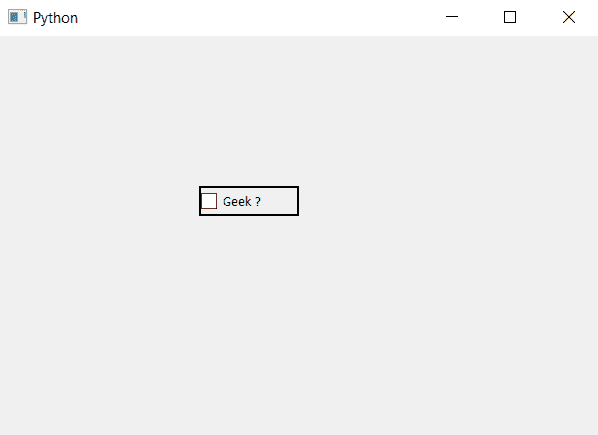

# PyQt5–带边框复选框

> 原文:[https://www.geeksforgeeks.org/pyqt5-bordered-check-box/](https://www.geeksforgeeks.org/pyqt5-bordered-check-box/)

在本文中，我们将看到如何设置边框为复选框。默认情况下，虽然复选框的指示器有自己的边框，但复选框没有边框，就像按钮一样。

下面是普通复选框的外观与带边框复选框的外观。
 

为了给整个复选框添加边框，我们必须更改它的 CSS 样式表，下面是样式表代码。

```
QCheckBox
{
border : 2px solid black;
}

```

这个样式表是和`setStyleSheet`方法一起使用的，下面是实现。

```
# importing libraries
from PyQt5.QtWidgets import * 
from PyQt5 import QtCore, QtGui
from PyQt5.QtGui import * 
from PyQt5.QtCore import * 
import sys

class Window(QMainWindow):

    def __init__(self):
        super().__init__()

        # setting title
        self.setWindowTitle("Python ")

        # setting geometry
        self.setGeometry(100, 100, 600, 400)

        # calling method
        self.UiComponents()

        # showing all the widgets
        self.show()

    # method for widgets
    def UiComponents(self):

        # creating the check-box
        checkbox = QCheckBox('Geek ?', self)

        # setting geometry of check box
        checkbox.setGeometry(200, 150, 100, 30)

        # adding border to checkbox
        checkbox.setStyleSheet("QCheckBox"
                               "{"
                               "border : 2px solid black;"
                               "}")

# create pyqt5 app
App = QApplication(sys.argv)

# create the instance of our Window
window = Window()

# start the app
sys.exit(App.exec())
```

**输出:**
