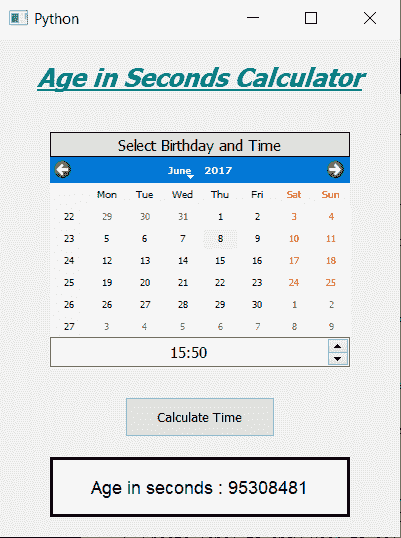

# PyQt5–计算你活了多少秒的计算器

> 原文:[https://www . geeksforgeeks . org/pyqt 5-你曾经生活过的秒数计算器/](https://www.geeksforgeeks.org/pyqt5-calculator-for-number-of-seconds-you-have-lived/)

在这篇文章中，我们将看到如何创建一个计算器，它可以告诉我们一个人活了多少秒。下面是计算器的样子



**概念:**借助 python datetime 对象，我们可以通过获取出生日期和出生时间与当前日期和时间的差值来获得以秒为单位的年龄，python datetime 对象将记录闰年，我们可以获得日期之间的天数和秒数。然后这些天可以转换成秒，得到总的秒计数。

> **GUI 实现步骤:**
> 1。创建显示计算器名称
> 2 的标题标签。创建标签显示用户选择出生日期和出生时间
> 3。创建一个 QCalendarWidget 对象供用户选择出生日期
> 4。创建一个 QTimeEdit 对象获取出生时间
> 5。创建一个按钮，以秒为单位计算年龄
> 6。创建一个标签，以秒为单位显示计算的年龄
> **后端实现:**
> 1。制作日历未来日期块，即将当前日期设为最大日期
> 2。向按钮
> 3 添加动作。在按钮操作中，从日历中获取日期，从
> 4 中获取时间。从日期获取日、月、年，从时间编辑
> 5 获取小时、分钟。为当前日期和出生日期创建日期时间对象
> 6。从两个日期中得到差值，得到天数和秒数
> 7。将天转换为秒，并将其添加到原始秒
> 8。通过标签
> 显示计算的秒值

下面是实现

## 蟒蛇 3

```py
# importing libraries
from PyQt5.QtWidgets import *
from PyQt5 import QtCore, QtGui
from PyQt5.QtGui import *
from PyQt5.QtCore import *
import datetime
import sys

class Window(QMainWindow):

    def __init__(self):
        super().__init__()

        # setting title
        self.setWindowTitle("Python ")

        # width of window
        self.w_width = 400

        # height of window
        self.w_height = 500

        # setting geometry
        self.setGeometry(100, 100, self.w_width, self.w_height)

        # calling method
        self.UiComponents()

        # showing all the widgets
        self.show()

    # method for components
    def UiComponents(self):

        # creating head label
        head = QLabel("Age in Seconds Calculator", self)

        head.setWordWrap(True)

        # setting geometry to the head
        head.setGeometry(0, 10, 400, 60)

        # font
        font = QFont('Times', 15)
        font.setBold(True)
        font.setItalic(True)
        font.setUnderline(True)

        # setting font to the head
        head.setFont(font)

        # setting alignment of the head
        head.setAlignment(Qt.AlignCenter)

        # setting color effect to the head
        color = QGraphicsColorizeEffect(self)
        color.setColor(Qt.darkCyan)
        head.setGraphicsEffect(color)

        # creating a label
        b_label = QLabel("Select Birthday and Time", self)

        # setting properties  label
        b_label.setAlignment(Qt.AlignCenter)
        b_label.setGeometry(50, 95, 300, 25)
        b_label.setStyleSheet("QLabel"
                              "{"
                              "border : 1px solid black;"
                              "background : rgba(70, 70, 70, 25);"
                              "}")
        b_label.setFont(QFont('Times', 9))

        # creating a calendar widget to select the date
        self.calendar = QCalendarWidget(self)

        # setting geometry of the calendar
        self.calendar.setGeometry(50, 120, 300, 180)

        # setting font to the calendar
        self.calendar.setFont(QFont('Times', 6))

        # getting current date
        date = QDate.currentDate()

        # blocking future dates
        self.calendar.setMaximumDate(date)

        # creating a time edit object to receive time
        self.time = QTimeEdit(self)

        # setting properties to the time
        self.time.setGeometry(50, 300, 300, 30)
        self.time.setAlignment(Qt.AlignCenter)
        self.time.setFont(QFont('Times', 9))

        # creating a push button
        calculate = QPushButton("Calculate Time", self)

        # setting geometry to the push button
        calculate.setGeometry(125, 360, 150, 40)

        # adding action to the calculate button
        calculate.clicked.connect(self.calculate_action)

        # creating a label to show percentile
        self.result = QLabel(self)

        # setting properties to result label
        self.result.setAlignment(Qt.AlignCenter)
        self.result.setGeometry(50, 420, 300, 60)
        self.result.setWordWrap(True)
        self.result.setStyleSheet("QLabel"
                                  "{"
                                  "border : 3px solid black;"
                                  "background : white;"
                                  "}")
        self.result.setFont(QFont('Arial', 11))

    def calculate_action(self):

        # getting birth date day
        birth = self.calendar.selectedDate()

        # getting year and month day of birth day
        birth_year = birth.year()
        birth_month = birth.month()
        birth_day = birth.day()

        # getting time of from the time edit
        time = self.time.time()

        # getting hour and seconds
        hour = time.hour()
        minute = time.minute()

        # getting today date
        current = QDate.currentDate()

        # getting year and month day of current day
        current = datetime.datetime.now()

        # converting  date into date object
        birth_date = datetime.datetime(birth_year, birth_month, birth_day, hour, minute, 0)

        # getting difference in both the dates
        difference = current - birth_date

        # getting difference in days
        days = difference.days

        # setting seconds
        seconds = difference.seconds

        # converting days into second and adding them
        seconds = seconds + days * 24 * 60 * 60

        # setting this value with the help of label
        self.result.setText("Age in seconds : " + str(seconds))

# create pyqt5 app
App = QApplication(sys.argv)

# create the instance of our Window
window = Window()

# start the app
sys.exit(App.exec())
```

**输出:**

<video class="wp-video-shortcode" id="video-434882-1" width="640" height="360" preload="metadata" controls=""><source type="video/mp4" src="https://media.geeksforgeeks.org/wp-content/uploads/20200615183538/Python-2020-06-15-18-34-55.mp4?_=1">[https://media.geeksforgeeks.org/wp-content/uploads/20200615183538/Python-2020-06-15-18-34-55.mp4](https://media.geeksforgeeks.org/wp-content/uploads/20200615183538/Python-2020-06-15-18-34-55.mp4)</video>