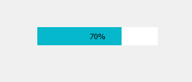
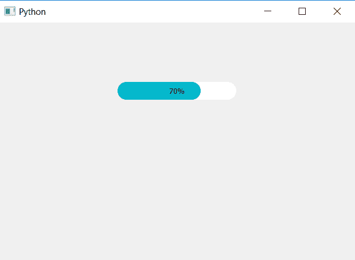

# PyQt5–胶囊形进度条

> 原文:[https://www . geesforgeks . org/pyqt 5-胶囊形进度条/](https://www.geeksforgeeks.org/pyqt5-capsule-shaped-progress-bar/)

在本文中，我们将看到如何创建胶囊形状的进度条。默认情况下，当我们创建进度条时，它是矩形的，尽管我们可以借助`resize`方法更改形状。但这将只允许将形状从矩形改为正方形。下面是普通进度条和胶囊形进度条的图示。

 

为了做到这一点，我们必须改变背景和进度条的边框半径，这是通过改变 CSS 样式表来完成的，下面是样式表代码。

```py
QProgressBar
{
border: solid grey;
border-radius: 15px;
color: black;
}
QProgressBar::chunk 
{
background-color: #05B8CC;
border-radius :15px;
}      

```

这个样式表是用哪个`setStyleSheet`方法，下面是实现。

```py
# importing libraries
from PyQt5.QtWidgets import * 
from PyQt5 import QtCore, QtGui
from PyQt5.QtGui import * 
from PyQt5.QtCore import * 
import sys

class Window(QMainWindow):

    def __init__(self):
        super().__init__()

        # setting title
        self.setWindowTitle("Python ")

        # setting background color to window
        # self.setStyleSheet("background-color : yellow")

        # setting geometry
        self.setGeometry(100, 100, 600, 400)

        # calling method
        self.UiComponents()

        # showing all the widgets
        self.show()

    # method for widgets
    def UiComponents(self):
        # creating progress bar
        bar = QProgressBar(self)

        # setting geometry to progress bar
        bar.setGeometry(200, 100, 200, 30)

        # setting the value
        bar.setValue(70)

        # setting alignment to center
        bar.setAlignment(Qt.AlignCenter)

        # setting background to color and radius
        # and bar color and bar radius
        bar.setStyleSheet("QProgressBar"
                          "{"
                          "border: solid grey;"
                          "border-radius: 15px;"
                          " color: black; "
                          "}"
                          "QProgressBar::chunk "
                          "{background-color: # 05B8CC;"
                          "border-radius :15px;"
                          "}")

App = QApplication(sys.argv)

# create the instance of our Window
window = Window()

# start the app
sys.exit(App.exec())
```

**输出:**
