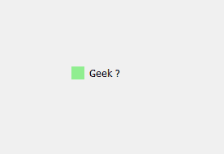
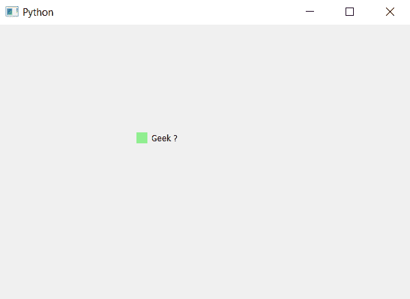

# pyqt 5–更改复选框指示器的颜色

> 原文:[https://www . geesforgeks . org/pyqt 5-更改复选框颜色-指示器/](https://www.geeksforgeeks.org/pyqt5-change-color-of-check-box-indicator/)

复选框基本上有两个组成部分，即标签和指示器。默认情况下，虽然我们可以更改指示器的颜色，但是没有为指示器设置特定的颜色。下面是普通指示器和彩色指示器的图示。

 

为了做到这一点，我们必须为复选框的指示器添加背景颜色，这可以使用指示器的样式表来完成。下面是可以与复选框对象一起使用的样式表代码。

```py
QCheckBox::indicator
{
background-color : lightgreen;
}

```

下面是实现。

```py
# importing libraries
from PyQt5.QtWidgets import * 
from PyQt5 import QtCore, QtGui
from PyQt5.QtGui import * 
from PyQt5.QtCore import * 
import sys

class Window(QMainWindow):

    def __init__(self):
        super().__init__()

        # setting title
        self.setWindowTitle("Python ")

        # setting geometry
        self.setGeometry(100, 100, 600, 400)

        # calling method
        self.UiComponents()

        # showing all the widgets
        self.show()

    # method for widgets
    def UiComponents(self):

        # creating the check-box
        checkbox = QCheckBox('Geek ?', self)

        # setting geometry of check box
        checkbox.setGeometry(200, 150, 100, 30)

        # adding background color to indicator
        checkbox.setStyleSheet("QCheckBox::indicator"
                               "{"
                               "background-color : lightgreen;"
                               "}")

# create pyqt5 app
App = QApplication(sys.argv)

# create the instance of our Window
window = Window()

# start the app
sys.exit(App.exec())
```

**输出:**
