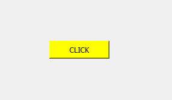
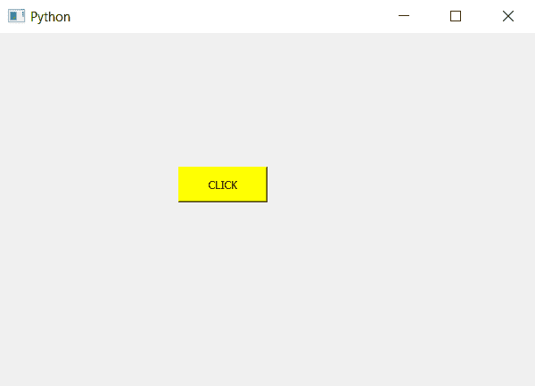

# PyQt5–改变按钮颜色

> 原文:[https://www . geesforgeks . org/pyqt 5-按钮变色/](https://www.geeksforgeeks.org/pyqt5-change-color-of-push-button/)

在本文中，我们将看到如何改变按钮的颜色。默认情况下，当我们创建一个按钮时，它是灰色的，尽管 PyQt5 允许我们更改这种颜色。下面是默认按钮和彩色按钮的区别。

 

为了做到这一点，我们将使用`setStyleSheet`方法。

> **语法:**按钮。设置样式表(“背景色:黄色”)
> 
> **自变量:**它以字符串为自变量。
> 
> **执行的操作:**为按钮添加颜色

**代码:**

```py
# importing libraries
from PyQt5.QtWidgets import * 
from PyQt5.QtGui import * 
from PyQt5.QtCore import * 
import sys

class Window(QMainWindow):
    def __init__(self):
        super().__init__()

        # setting title
        self.setWindowTitle("Python ")

        # setting geometry
        self.setGeometry(100, 100, 600, 400)

        # calling method
        self.UiComponents()

        # showing all the widgets
        self.show()

    # method for widgets
    def UiComponents(self):

        # creating a push button
        button = QPushButton("CLICK", self)

        # setting geometry of button
        button.setGeometry(200, 150, 100, 40)

        # changing color of button
        button.setStyleSheet("background-color : yellow")

        # adding action to a button
        button.clicked.connect(self.clickme)

    # action method
    def clickme(self):

        # printing pressed
        print("pressed")

# create pyqt5 app
App = QApplication(sys.argv)

# create the instance of our Window
window = Window()

# start the app
sys.exit(App.exec())
```

**输出:**
