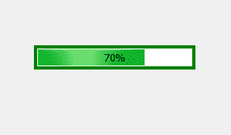
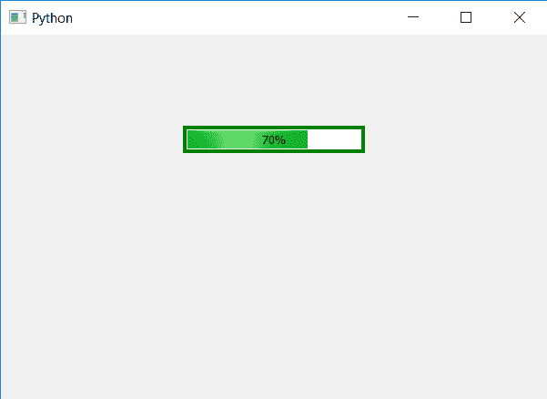

# PyQt5–更改进度条的边框

> 原文:[https://www . geeksforgeeks . org/pyqt 5-进度条更改边框/](https://www.geeksforgeeks.org/pyqt5-changing-border-of-progress-bar/)

在本文中，我们将看到如何更改或设置进度条的边框。默认情况下，PyQt5 为进度条提供边框，但我们可以根据自己的方便进行更改。下面是默认边框进度条和样式化边框进度条的外观。

 

为了做到这一点，我们必须借助`setStyleSheet()`方法改变进度条的 CSS 样式表。

> **语法:**
> 
> ```
> bar.setStyleSheet("QProgressBar"
>                   "{"
>                   "border : 4px solid green"
>                   "}")
> 
> ```
> 
> **自变量:**它以字符串为自变量。
> 
> **执行的动作:**它将为进度条添加边框。

下面是实现

```
# importing libraries
from PyQt5.QtWidgets import * 
from PyQt5 import QtCore, QtGui
from PyQt5.QtGui import * 
from PyQt5.QtCore import * 
import sys

class Window(QMainWindow):

    def __init__(self):
        super().__init__()

        # setting title
        self.setWindowTitle("Python ")

        # setting geometry
        self.setGeometry(100, 100, 600, 400)

        # calling method
        self.UiComponents()

        # showing all the widgets
        self.show()

    # method for widgets
    def UiComponents(self):
        # creating progress bar
        bar = QProgressBar(self)

        # setting geometry to progress bar
        bar.setGeometry(200, 100, 200, 30)

        # setting the value
        bar.setValue(70)

        # setting alignment to center
        bar.setAlignment(Qt.AlignCenter)

        # adding border to the progress bar
        bar.setStyleSheet("QProgressBar"
                          "{"
                          "border : 4px solid green"
                          "}")

App = QApplication(sys.argv)

# create the instance of our Window
window = Window()

# start the app
sys.exit(App.exec())
```

**输出:**
